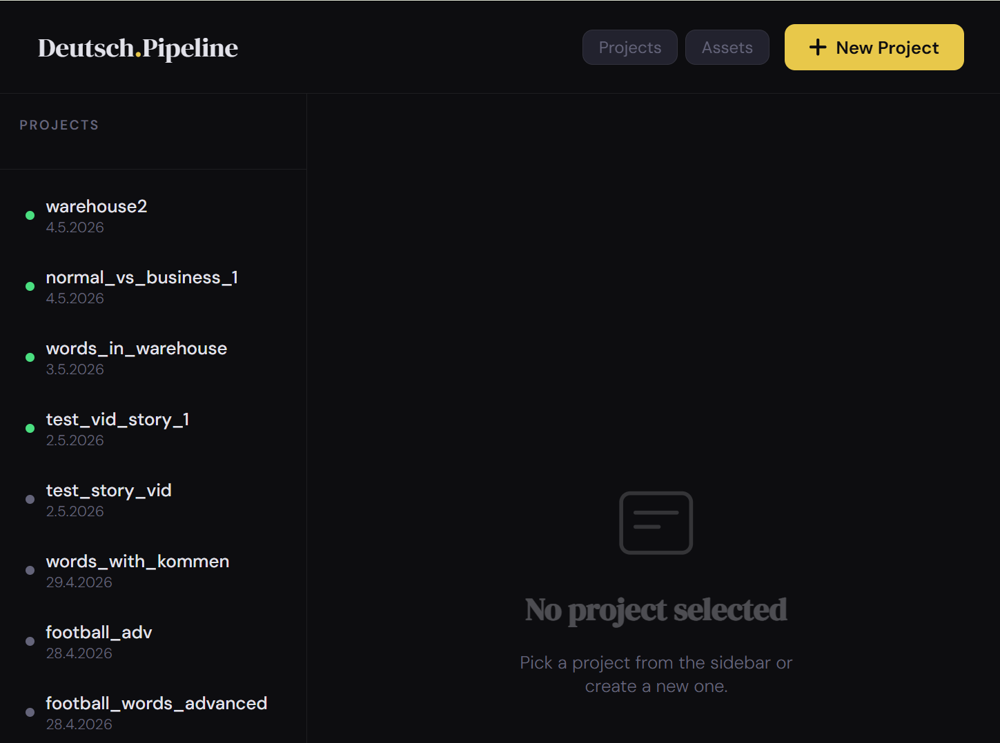
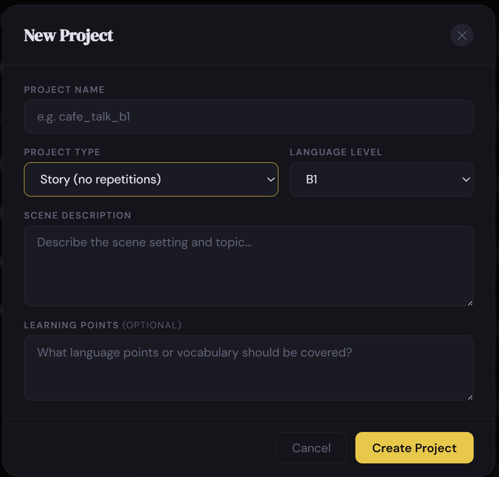
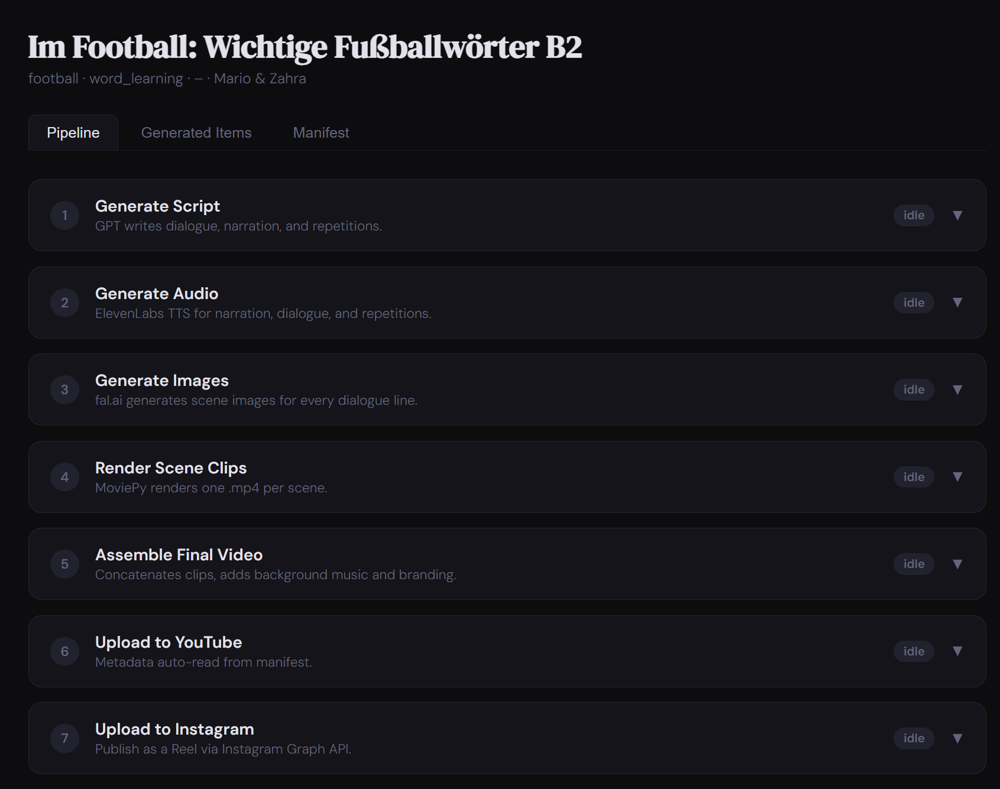
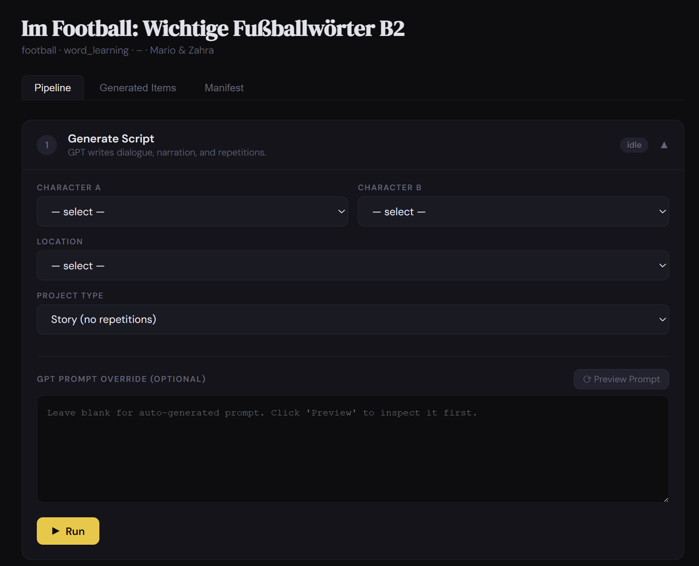
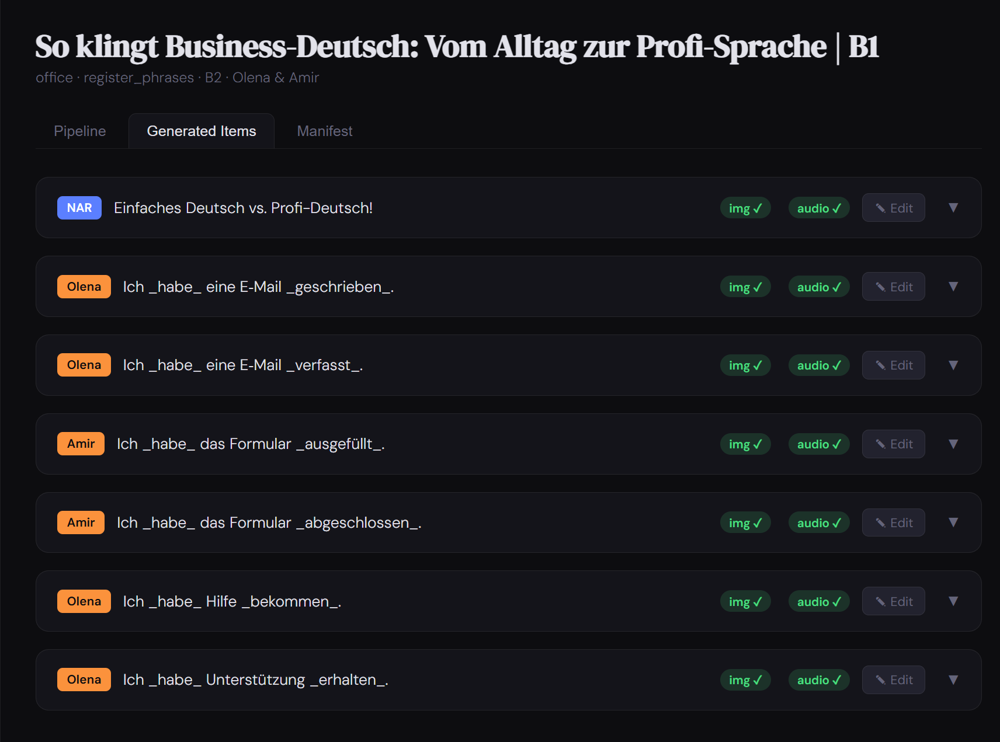
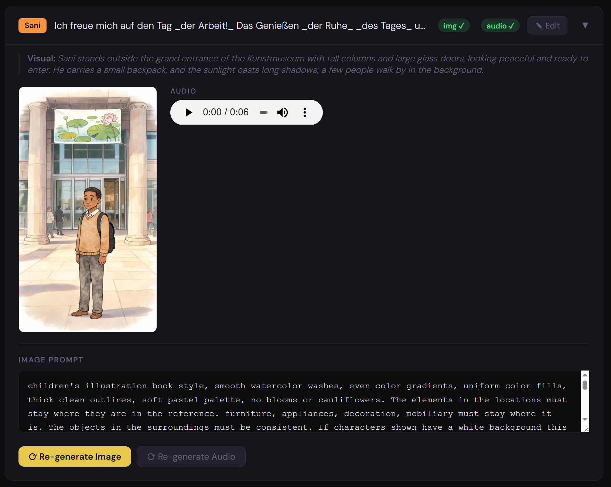
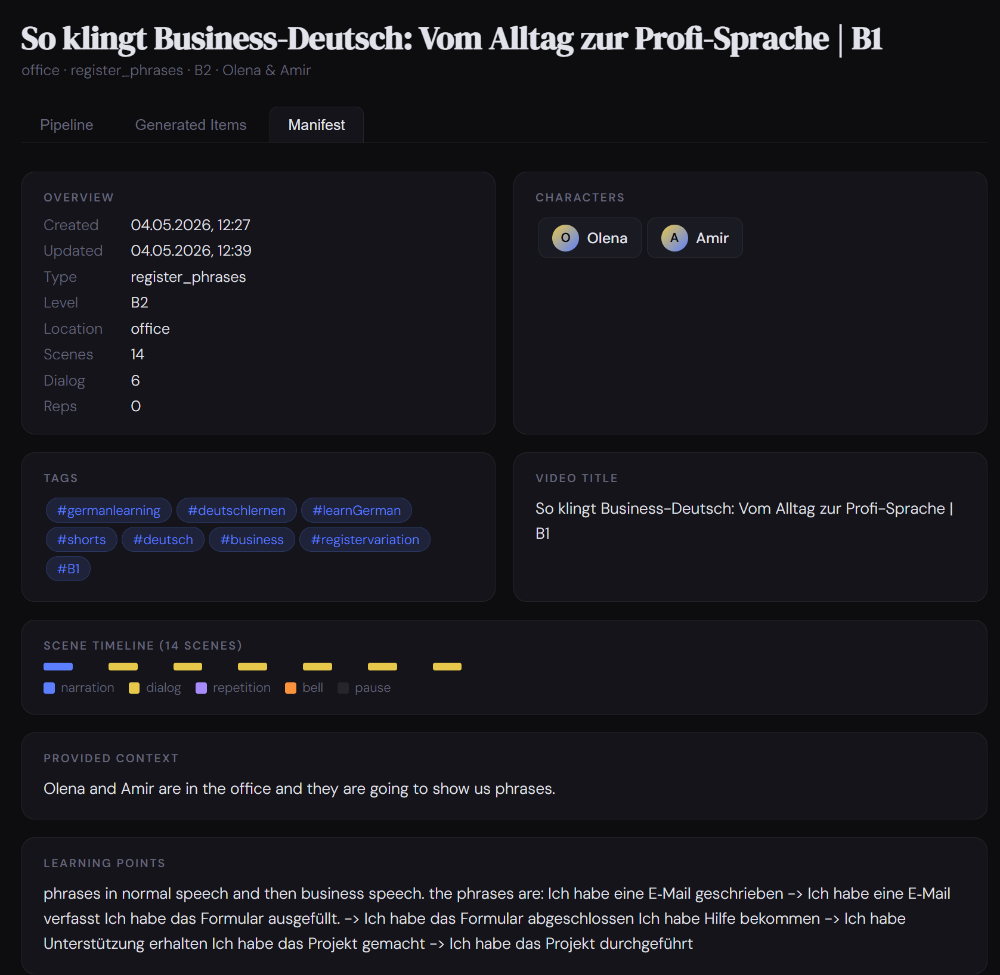

# AI-Powered Language Learning Video Generator

An automated pipeline for creating educational German language learning videos. Provide characters, a scene description with optional **visual guidelines**, and a learning objective — the system writes the script, generates voiced audio, illustrates every scene with AI art, renders subtitled clips, and assembles a finished video ready for upload. By default no pre-made location is used: the setting and the characters' attire come straight from your scene description and visual guidelines (a location from the library is an opt-in override).

Two output formats are supported:

- **Vertical 1080×1920** (9:16) — short-form for YouTube Shorts and Instagram Reels
- **Horizontal 1920×1080** (16:9 Full HD) — long-form for standard YouTube videos

The output format is determined by the project type chosen at creation time. No per-project configuration is needed.

A third, specialised project type — **Reading Together** (`reading_together`) — turns a pasted public-domain short story into a sentence-by-sentence "read along" video with **grammar-annotated** on-screen text (TEKAMOLO boxes, separable-verb colouring, Nebensatz + verb-position markers, case/gender). It outputs several vertical 6-sentence **parts** plus one **long horizontal** video, and can create reusable single-image characters such as talking animals. See [Reading Together](#reading-together-reading_together).

A **web-based control panel** (`app.py`) lets you manage every project and asset and run every pipeline step from a browser with no command-line work required.

---

## Two Ways to Work

There are two ways to drive the pipeline. They share the same manifest and the same generation code — pick whichever fits how you're working.

| | **Method 1 — Classic Web UI** | **Method 2 — Claude Code (MCP)** |
|---|---|---|
| How | Point-and-click in the browser (`app.py`) | Chat naturally in Claude Code; Claude calls the pipeline via MCP tools |
| Best for | Full control: editing scenes, regenerating single images/audio, previewing, assembly, upload | Refining an idea in chat and turning it straight into a project + script — no copy-pasting |
| Covers | Every pipeline step, end to end | The **brief seam** only: `create_project` + `generate_script` (the GPT step) |
| Setup | [Start the web control panel](#6-start-the-web-control-panel) | [Claude Code MCP Bridge](#claude-code-mcp-bridge) |

A common workflow is to **combine them**: use Claude Code to refine the idea and generate the script, then open the web UI on that same project to review, generate audio/images, and assemble the final video.

---

## Web UI

### Projects dashboard
The sidebar lists all your projects with status indicators. Hit **+ New Project** to open the creation modal — pick a project type, language level, describe the scene, and optionally specify learning points and **visual guidelines** (an art-direction brief — setting, character clothing/props, mood — applied to every scene).

<p align="center">
  
  &nbsp;&nbsp;
  
</p>

### Pipeline tab
Every pipeline step is a collapsible card showing its status (`idle` / `running` / `done` / `error`). Steps run in background threads — the UI stays responsive and polls for updates automatically. While a step runs, a **live progress bar** shows how many elements have been processed (e.g. `Audio 7/24`, `Image 3/40`, `Clip 12/120`), proportional to the work done in that step's main loop.

<p align="center">
  
  &nbsp;&nbsp;
  
</p>

### Generated Items tab
Every scene is shown as a card with its German text, image/audio status badges, and an Edit button. Expand any card to see the generated illustration, play the audio, edit the image prompt, and re-generate image or audio individually without re-running the full pipeline.

<p align="center">
  
  &nbsp;&nbsp;
  
</p>

### Manifest tab
A live read-only view of the project manifest — shows metadata, scene timeline, tags, video title, characters, and the provided context and learning points at a glance.

<p align="center">
  
</p>

---

## Pipeline Overview

```
create_project → create_script → create_audio → create_images → create_video → assemble_video → upload
```

Each step reads from and writes back to a single `project_manifest.json` file, making the pipeline fully resumable at any stage.

**Reading Together** projects use an alternate flow (same manifest, different builder + packaging):

```
create_project → reading_build → create_audio → reading_cast → create_images →
create_video (vertical) → create_video (horizontal) → reading_assemble
```

---

## Pipeline Steps

### 1. Project Initialization (`create_project.py`)

Creates the project directory structure and initializes the manifest with the provided metadata, learning objectives, and pipeline configuration defaults.

Manifest sections created:

| Section | Contents |
|---|---|
| `project_metadata` | name, creation date, project type key |
| `video_info` | title, tags, format, insights (filled by script step) |
| `generation_config` | location (optional), visual guidelines, characters, level, prompts, raw GPT output |
| `pipeline_config` | inter-pause duration, repetition pause factor |
| `scenes` | empty list; populated by script step |

---

### 2. Script Generation (`create_script.py`)

Calls GPT to generate structured dialogue, narration, and (for `shadowing` projects) repetition sentences. Converts the GPT response into a flat `scenes[]` array of universal scene objects.

**Project types** are defined entirely in `assets/project_types/project_types.json` — adding a new video format requires no Python changes.

#### Vertical types (1080×1920, 9:16 — Shorts / Reels)

| Project Type | Description | Characters | Default dialogue count |
|---|---|---|---|
| `shadowing` | Dialogue + 3-sentence repetition/shadowing section. Good for pronunciation practice. | 2 | 4–6 lines |
| `story` | Pure narrative dialogue, no repetitions. Good for comprehension. | 2 + optional extras | 4–6 lines |
| `word_learning` | One scene per vocabulary word; speaker says the word then uses it in a sentence. | 2 + optional extras | driven by word list |
| `register_phrases` | Paired sentences showing the same idea in two registers (e.g. formal vs. colloquial). Visual clothing change reinforces the register shift. | 2 + optional extras | 3 pairs |
| `grammar_pairs` | Paired sentences showing a grammatical construction (e.g. present → Präteritum). Visual cues (sepia memory-bubble for past tenses, dreamy glow for Konjunktiv II) reinforce the transformation. | 2 | 5 pairs |

`story`, `word_learning`, and `register_phrases` support **more than two characters**: Character A and Character B are required, and additional cast members can be added in the Script step UI. The extra characters appear in the GPT prompt and can show up in scene illustrations (up to `max_scene_characters` per illustration, configurable in `create_script.py`).

#### Horizontal types (1920×1080 Full HD, 16:9 — YouTube long-form)

Each `_long` type mirrors its vertical counterpart in content and structure, but generates wider scenes with a cinematic 16:9 framing and a higher default dialogue count for longer video runtime.

| Project Type | Based on | Characters | Default dialogue count |
|---|---|---|---|
| `shadowing_long` | `shadowing` | 2 | 10–14 lines + repetition section |
| `story_long` | `story` | 2 + optional extras | 10–14 lines |
| `word_learning_long` | `word_learning` | 2 + optional extras | driven by word list |
| `register_phrases_long` | `register_phrases` | 2 + optional extras | 6 pairs |
| `grammar_pairs_long` | `grammar_pairs` | 2 | 8 pairs |

When a horizontal type is selected, the pipeline applies Full HD settings at every stage: fal.ai generates `landscape_16_9` images, the video canvas is set to 1920×1080, and subtitle/icon positions are adjusted for the wider frame. The `video_format` field in the manifest is set to `"horizontal"` at project creation and propagates through all downstream steps. These per-orientation values live in the **`[vertical]` and `[horizontal]` sections of `config.ini`** (see [Configuration](#configuration-configini)) and are applied at render time by `apply_video_format()` — so each orientation can be tuned independently without code changes.

**How scene images work:** every dialogue line includes a `scene_visual` field — a concrete English description of what the speaking character is *doing* relative to what they're saying. This description drives the image prompt, producing action-based illustrations rather than static talking-head shots.

**Character descriptions for image prompts:** only `fixed_description` (permanent appearance — face, hair, body type) is used when building image prompts. `variable_description` (outfit, accessories) is included in the GPT script prompt so dialogue context is accurate, but is excluded from image prompts to avoid clothing conflicts.

Each scene object in `scenes[]` carries:

| Field | Description |
|---|---|
| `id` | Stable scene identifier (`scene_001`, `scene_002`, …) |
| `description` | Human-readable label (e.g. `dialog_002 [Sani]`) |
| `_is_narration` | `true` on the opening narration scene |
| `_is_repetition` | `true` on shadowing repetition scenes |
| `scene_visual` | English action description (dialog scenes) |
| `scene_characters` | `"speaker_only"` or `"both"` — controls composite reference for image generation |
| `image` | `file_path`, `prompt_to_create`, `reference_type`, `speaker` |
| `audio` | `type` (`tts`/`sfx`/`video_clip`/`null`), `file_path`, `tts_text`, `voice_id` |
| `subtitle_text` | On-screen subtitle text |

The raw GPT JSON response is saved to `generation_config.raw_gpt_script` before parsing, so any parse failures can be diagnosed without re-running the API call.

**Batched generation for long dialogs:** a single GPT call has a finite output-token budget, so very long dialogs (e.g. 200 lines) would otherwise be silently truncated — the model closes the JSON early, producing fewer lines than requested. When an explicit `dialog_count` exceeds `[script] dialog_batch_size` (default 40), the script step automatically generates the dialogue in chunks: the first call returns the metadata + narration + first chunk, and continuation calls each add the next chunk (given a recap of recent lines for continuity) until the requested count is reached. The chunks are merged into one script. The grammar auto-evaluation pass is batched the same way. Because output tokens dominate cost and are billed at the configured model's rate either way, batching on a cheap model is significantly cheaper than switching to a larger-output model — and it scales to any length. If a single chunk ever still truncates (`finish_reason == "length"`), the run fails loudly with an actionable message rather than returning a partial script; lower `dialog_batch_size` in that case.

**Prompt preview:** before running the script step, you can load the exact GPT prompt in the UI (fully editable) and submit a custom override — without making an API call.

**Character auto-detection:** when opening the Script step, the UI scans `provided_context` (your scene description) for known character names and pre-fills the Character A / Character B dropdowns automatically. For multi-character types (`story`, `word_learning`, `register_phrases` and their `_long` variants), additional cast members beyond the first two can be added via checkboxes that appear below the main dropdowns.

**Visual guidelines & locations:** by default **no pre-made location is used**. The setting, the characters' clothing/props and the overall mood come from the optional **`visual_guidelines`** field (set at project creation) together with the scene description. When `visual_guidelines` is provided, it is injected verbatim into every scene's `Scene at:` image prompt and appended to the GPT script prompt as a mandatory `=== VISUAL GUIDELINES ===` block — so it shapes both the authored `scene_visual`s and the illustrations, and it applies even to project types (like `word_learning`) that don't otherwise read the free-text context. If neither a location nor visual guidelines are given, GPT falls back to choosing an appropriate setting on its own.

Selecting a pre-made location is now an **opt-in override**: tick "Use specific location" (or pass `location_key` to `generate_script`) to reuse a library location's description and reference artwork instead of the guidelines-driven environment.

**Dialogue count override:** you can specify exactly how many dialogue lines (or pairs, for `register_phrases`/`grammar_pairs`) to generate. Leave blank to use the project type's default range. The count is injected into the GPT prompt via the `{DIALOG_COUNT}` placeholder.

---

### 3. Audio Synthesis (`create_audio.py`)

Generates TTS audio via ElevenLabs for every `audio.type == "tts"` scene. Iterates `scenes[]` directly; skips scenes whose `audio.file_path` is already set. Fills `audio.duration_ms` after generation.

Individual scenes can be re-synthesised via the web UI or via the `/run/audio_scene` API endpoint, useful for fixing a single line without re-running the full audio step.

---

### 4. Visual Asset Generation (`create_images.py`)

Generates scene images via fal.ai for every scene with a non-null `image` object and a null `file_path`.

**Reference composite:** before calling fal.ai the module builds a side-by-side reference image from local character artwork and the location background. This gives the model consistent visual anchors for style, clothing, and faces.

| `reference_type` | Composite contents |
|---|---|
| `both` | char A art + char B art + location background |
| `single_speaker` | speaking character art + location background |
| `none` | no reference image — image generated from text prompt only |

The `none` mode uses a separate text-to-image call without any reference composite. This is useful for abstract or highly stylised scenes where character consistency is less important, or when no character reference art is available.

Image prompts are pre-built by `create_script.py` and stored in `scene.image.prompt_to_create`. This module only builds the reference and calls the API.

**Format-aware image size:** the `image_size` passed to fal.ai comes from the orientation section in `config.ini` — `[vertical] fal_image_size` (default `portrait_16_9`) or `[horizontal] fal_image_size` (default `landscape_16_9`) — applied by `apply_video_format()` based on the manifest's `video_format`. The base `[fal] image_size` is the fallback.

Flag: `--overwrite` — regenerate images even when the file already exists in `project/images/`.

**Image-saving mode (2×2 mosaic — horizontal only):** when the **"Image-saving mode"** checkbox is ticked (shown only for horizontal projects), the dialogue scenes are batched into groups of four and rendered as a **single 2×2 mosaic image** that is then reused for all four scenes. Each batch makes **one** fal.ai call instead of four: the four scenes' panel descriptions are combined into one prompt with the global style tokens included only once, a 2×2 grid layout instruction is appended, and the reference composite carries the union of every character reference across the four panels (plus the location). The opening narration scene always keeps its own full-frame image and is never mosaiced. The shared image is saved under the first scene's id and every scene in the batch points its `image.file_path` at it. CLI flag: `--mosaic` (ignored for vertical projects).

Individual scenes can be regenerated via the web UI (Generated Items tab → Re-generate Image) or via the `/run/image_scene` API endpoint.

---

### 5. Video Rendering (`create_video.py`)

Renders one `.mp4` clip per scene by dispatching on `scene.audio.type`.

**Format-aware canvas:** before rendering begins the module reads `video_format` from the manifest and applies the matching `config.ini` section (`[vertical]` or `[horizontal]`) over the base config via `apply_video_format()`. Those sections hold the per-orientation canvas size, subtitle/narrator font size, subtitle bottom margin, and speaker-icon position — so horizontal (1920×1080) and vertical (1080×1920) are each tuned in config rather than hardcoded.

| `audio.type` | Behaviour |
|---|---|
| `"tts"` | Freeze scene image for audio duration + subtitle overlay |
| `"sfx"` | Freeze previous frame for SFX audio duration |
| `"video_clip"` | Insert a raw `.mp4` file (e.g. intro/outro) |
| `null` | Render a silent black pause of `scene.duration_ms` — unless it's a shadowing **repeat scene** (see below) |

**Footnote / disclaimer + read time:** a scene-level `footnote` field (or the global footnote passed at render time, used on narration scenes) draws a small disclaimer below the subtitle. When a footnote is shown, the scene is held for an extra silent moment **after** the narration audio so viewers have time to read it — the held frame keeps the image, subtitle and footnote on screen. The hold defaults to `config.ini → [footnote] hold_ms` and is overridable per render from the Video step ("Footnote read time", in seconds); `0` disables it.

**Shadowing repeat scenes:** an optional intermediate scene placed after each dialog line (before its pause) that holds the dialog's image with the subtitle **still readable** plus a centered message (the "now repeat" cue, e.g. *Jetzt wiederholen*) — so a learner can shadow/repeat the line while reading it. Add or remove them from the **Generated Items** tab (or `POST /projects/<name>/repeat_scenes`, or `python repeat_scenes.py <project> add|remove`). The message text and font live in `config.ini → [repeat_prompt]`; the message and font size can also be overridden per render from the Video step. The held duration defaults to the dialog line's own length (`duration_ms = 0` in config) times a **time factor** (`duration_factor`, or the "Time factor ×" field on the Add/Re-sync control) so you can give more reading/repeating time than the line took to speak (e.g. `1.5` = 50% longer); a fixed `duration_ms > 0` overrides the mirror+factor. Every hold is also editable per scene. The centered message is drawn like the on-screen warning label, over a semi-transparent box in the middle of the frame. When grammar-annotated subtitles are on, the repeat scene reuses the dialog's annotation so the two match.

**Subtitle markup:** subtitles support three inline markers written directly into GPT-generated text:

| Marker | Subtitle | TTS audio | Use for |
|---|---|---|---|
| `_text_` | italic + highlight colour | spoken normally | grammar features, key vocabulary |
| `*text*` | bold | spoken normally | strong emphasis |
| `-text-` | shown as plain text | **silent — not spoken** | speaker labels, section headings |

The `-text-` marker lets you display text on screen without it being read aloud. For example `"-Sani:- Guten Morgen!"` renders the subtitle as `Sani: Guten Morgen!` but ElevenLabs only receives `Guten Morgen!`.

Italic and bold styling attributes are configurable in `config.ini` under `markup_italic_attrs` and `markup_bold_attrs`.

Subtitle style: narration/repetition scenes → centred; dialogue scenes → bottom-aligned.

**Grammar-annotated subtitles:** when `annotated_subtitles` is enabled, dialogue and reading subtitles are rendered by `html_annotation_renderer.py` instead of the plain text renderer. Each sentence is first analysed by `generate_annotations.py` (GPT) into a token + span schema, then drawn as styled HTML/CSS and rasterised to a transparent PNG — with a rounded semi-transparent dark backing baked in — via headless Chromium (Playwright). It colours the two halves of a *trennbares Verb* the same, and for verbs shows the conjugation **tense** above and the **infinitive** below the word; it labels case/gender above the other words. Each word reserves equal space above and below so the main words stay on one centred line. The only clause box drawn is the **Nebensatz** (subordinate clause), and only when the clause actually moves the conjugated verb to the end (the verb-position contrast) — it carries a "↳ Verb" marker; the old TEKAMOLO fields are no longer boxed. A long Nebensatz wraps inside its box. All annotation PNGs for a video are pre-rendered in a single Chromium session for speed. Requires `pip install playwright` and `python -m playwright install chromium`. If Chromium is missing when annotated subtitles are requested, the render tries to install it automatically (one-time); if that fails it stops with a clear error telling you to run the install commands, rather than silently downgrading to plain subtitles. Schema details: [`ANNOTATION_SCHEMA.md`](ANNOTATION_SCHEMA.md).

**Annotation caching (saves OpenAI calls):** every successful annotation is cached per scene at `videos/_annot/<scene_id>.json` (and `videos/h/_annot/...` for the horizontal pass), keyed by the exact sentence text plus a schema version (`generate_annotations.CACHE_VERSION`). On every later render the cached JSON is reused, so **re-rendering does not re-prompt OpenAI** — only sentences whose text changed, or whose cache was explicitly reset, hit the API. Fallback results (from an API failure) are never cached, so a transient error won't get stuck. The PNG itself is still redrawn each render, so it always reflects the current size/orientation settings.

To force fresh annotations:

- **Redo all** — tick **“Regenerate annotations (ignore cache)”** under *Grammar-annotated subtitles* in any render step (Render Scene Clips / Render Vertical Clips / Render Horizontal Clips). It re-prompts OpenAI for every sentence and re-renders the clips (it implies a clip overwrite, otherwise existing clips would be skipped and you'd see no change).
- **Redo / edit one** — open a sentence's card in the **Generated Items** tab and expand **“Grammar annotation”**. You can see every token with its case/gender, role, tense, infinitive and separable-verb group, plus the Nebensatz clause boxes. Click the **×** on any chip to drop an attribute you don't want (or remove a clause box), then **Save** — the edit is written straight to the cache (no OpenAI call) and the scene's clip is cleared so the next render applies it. **↻ Regenerate (OpenAI)** discards the edits and re-prompts just that one sentence. Backed by `GET`/`POST /projects/<name>/annotations/<scene_id>`.

**Annotation text size:** the **“Annotation text size”** field (× scale, 0.5–2.5) next to the grammar checkbox scales the whole annotation — word plus the tense/case/infinitive labels — together, while the wrap width stays fixed (`font_scale` on `render_annotation_html` / `render_annotation_png`).

**Re-rendering a single clip (`create_video_single`):** instead of re-rendering the whole project you can rebuild **one scene's clip plus the silent pause that immediately follows it** — "everything related to that dialog line". The freeze-frame background of the rebuilt clip(s) is taken from the previous scene's already-rendered clip, so the result stays consistent with the surrounding video. Driven from the **Generated Items** tab (the **⟳ Re-render Clip (+ pause)** button on each scene card, with an optional *annotated subtitles* checkbox that reuses the annotation cache) or via `POST /projects/<name>/run/video_scene`. CLI: `python create_video.py <project> --scene-id scene_007`.

---

### 6. Assembly (`assemble_video.py`)

Concatenates all per-scene clips, adds a looping background audio track with fade-in/out, and writes the final `final_<project_name>.mp4`.

**Gapless concatenation:** per-scene clips are joined with the FFmpeg concat *filter* (`ffmpeg_concat_scenes()`), not MoviePy's `concatenate_videoclips`. Each scene `.mp4` is AAC-encoded, which adds ~1024 priming samples and leaves the audio track slightly shorter than the video track; MoviePy would fill that gap at every boundary by repeating the last audio buffer, producing an audible fragment of the previous clip's sound bleeding into the following (often silent) pause. Decoding through the concat filter trims the priming and pads short audio tails with real silence, and normalises every input (canvas size, fps, 44.1 kHz stereo) so mixed-resolution inserts concatenate cleanly. The reading assembler (`assemble_reading.py`) uses the same helper.

**Speed adjustment:** an optional FFmpeg pass changes playback speed without pitch shift. Set `speed_factor` in `config.ini` (e.g. `0.95` for 5% slower) or override per-project in the UI. The `atempo` filter is chained automatically when the factor falls outside the 0.5–2.0 range a single filter supports.

**Branding clips:** an optional intro and/or outro clip from `assets/branding/` can be attached via FFmpeg concat.

| `branding_mode` | Result |
|---|---|
| `none` | No branding (default) |
| `intro` | Branding clip prepended |
| `outro` | Branding clip appended |
| `both` | Branding clip prepended and appended |

The branding file is selectable from a dropdown in the UI (populated live from `assets/branding/`).

**Pipeline flow:** MoviePy writes `final_<name>_raw.mp4` → optional speed pass `_spd.mp4` → optional branding concat `_branded.mp4` → renamed to `final_<name>.mp4`. Intermediate files are deleted automatically.

---

### 7. Upload

Three upload targets are available, each its own independent integration. Credentials
are configured once on the **Connections** page (see [Connecting Your Accounts](#connecting-your-accounts-youtube--instagram--facebook)); each pipeline upload step then just shows a connected/not-connected banner and the per-video options.

#### YouTube (`upload_video.py`)

Uploads the final video to YouTube via the YouTube Data API v3. Reads title, description, and tags from the manifest — the UI pre-fills these as **editable fields** so you can preview and tweak them before uploading. Supports privacy, category, made-for-kids, and **scheduled release**: pick a future date/time and the video is uploaded private with `status.publishAt` set, which YouTube auto-flips to public at that time (`--publish-at <RFC3339-UTC>` on the CLI). Supports resumable chunked upload with retry. Caches OAuth credentials in `token.json`.

#### Instagram (`upload_instagram.py`)

Uploads the final video to Instagram as a Reel via the Instagram Graph API v25.0. Instagram has no publishing API of its own — it publishes *through* a linked Facebook Page, so this flow discovers the Instagram Business account attached to one of your Pages. Credentials are stored in `instagram_creds.json`; the long-lived token is auto-refreshed when fewer than 7 days remain.

Upload pipeline: create Reel container → chunked resumable upload → poll until FINISHED → publish.

Per-upload options: **caption**, **share-to-feed**, and a **cover frame** (`thumb_offset`, in seconds — Instagram grabs that frame as the Reel thumbnail, no image hosting required). Instagram's Graph API has **no native scheduling** and **no auto-caption** parameter, so those are not offered.

#### Facebook (`upload_facebook.py`)

Uploads the final video **directly to a Facebook Page** — as a feed video or a **Reel** — via the Graph API v25.0. This is a **standalone** integration: it talks to the Page with that Page's own access token and needs no Instagram account or linked-account discovery. It exists precisely so Facebook publishing no longer piggybacks on the Instagram flow. Credentials are stored in `facebook_creds.json`.

Per-upload options: **caption/description**, **publish-as-Reel** toggle, **scheduled release** (`scheduled_publish_time` — feed videos up to 6 months out, Reels up to 29 days; publishes automatically at that time), and, for **feed videos only**, a **cover frame** (a frame is extracted with ffmpeg and sent as the `thumb`). Facebook Reels have no thumbnail parameter in the publish call, so the cover-frame field is hidden when *Publish as a Reel* is ticked.

> **Capability notes (verified against Meta Graph API v25.0):** scheduling is supported for **Facebook** (feed + Reel) and **YouTube**, but **not** for Instagram. **Automatic captions/subtitles are not exposed by the Instagram or Facebook APIs** at all (Facebook only accepts a manually uploaded `.srt` afterward). Thumbnails: Instagram via a frame offset, Facebook feed video via an extracted frame — not available for Facebook Reels.

---

## Connecting Your Accounts (YouTube · Instagram · Facebook)

All three publishing integrations are managed from one place: the **Connections** page, reached from the **Connections** button in the top navigation bar (next to *Projects* and *Assets*).

Each platform gets a card that shows its **live status**, its **non-sensitive parameters**, a **Test Connection** button, and the setup controls. Secret values never appear in this page or in any API response — see [How secrets are handled](#how-secrets-are-handled) below.

<p align="center">
  
</p>

### How secrets are handled

A **hybrid** model keeps the sensitive material off the screen entirely:

- **Static app credentials live in `.env`** — the Facebook App ID/Secret (`FB_APP_ID` / `FB_APP_SECRET`, shared by Instagram and Facebook) and, optionally, the YouTube OAuth client (`GOOGLE_CLIENT_ID` / `GOOGLE_CLIENT_SECRET`). These identify *the app*, not you.
- **Runtime user tokens live in local credential files** the backend writes and refreshes: `token.json` (YouTube), `instagram_creds.json`, `facebook_creds.json`. All are git-ignored.
- The Connections page only ever receives **presence booleans** (e.g. "`FB_APP_ID`: set"), **identifiers** (IG User ID, Page ID/name), and **status/expiry** — never a key, secret, or token.

To learn the mechanics behind each flow in detail, the connection code is written to be read: see the "How the connection works" block at the top of [`upload_video.py`](upload_video.py), [`upload_instagram.py`](upload_instagram.py), and [`upload_facebook.py`](upload_facebook.py).

### YouTube

YouTube uses **OAuth 2.0** (not an API key): you consent once in a browser, and the app then acts on your behalf.

1. In the **Google Cloud Console**, create a project and enable **YouTube Data API v3**.
2. Create an **OAuth 2.0 Client ID** of type **Desktop app**.
3. Give the app that client, either way:
   - put `GOOGLE_CLIENT_ID` / `GOOGLE_CLIENT_SECRET` in `.env`, **or**
   - download the client JSON and save it as `client_secret.json` in the project root.
4. The **first** upload opens a browser for consent; the resulting token is cached in `token.json` and refreshed automatically forever after. (There is no button to pre-authenticate — running one upload completes the sign-in.)
5. Use **Test Connection** to confirm the cached token is valid. The pipeline's token only carries the `youtube.upload` scope, so the test reports *"token is valid (upload scope)"* rather than your channel name — that's expected and still means you're connected. **Reset YouTube Login** clears `token.json` to force a fresh consent.

### Instagram

Instagram publishes **through** a Facebook Page, so you authenticate as your Facebook user and the backend finds the Instagram Business account linked to your Page.

**Prerequisites:** an Instagram **Business/Creator** account, linked to a **Facebook Page** (*Instagram → Settings → Account → Linked Accounts → Facebook*).

1. Create a Facebook App at [developers.facebook.com](https://developers.facebook.com) (type **Business**, add the **Instagram Graph API** product).
2. Put the app's **App ID** and **App Secret** into `.env` as `FB_APP_ID` / `FB_APP_SECRET`.
3. In the [Graph API Explorer](https://developers.facebook.com/tools/explorer/), generate a **User Access Token** (leave *User or Page* as *Get Token* — a user token, **not** a Page token) with the permissions `instagram_basic`, `instagram_content_publish`, `pages_show_list`.
4. On the Instagram card, paste that **short-lived token** into *Setup* and click **Save Credentials**. (Optionally paste the Instagram User ID to skip auto-detection.) The backend exchanges the short-lived token for a **~60-day long-lived** one and discovers your IG account id automatically.
5. **Test Connection** should report your account name. The token auto-refreshes when fewer than 7 days remain; **Reset** clears the stored credentials.

### Facebook

Facebook posting is **independent of Instagram** — it targets a Page directly and needs only that Page's id and token.

1. Reuse the same Facebook App (its `FB_APP_ID` / `FB_APP_SECRET` in `.env`), and make sure you're an **admin** of the target Page.
2. In the [Graph API Explorer](https://developers.facebook.com/tools/explorer/), generate a **User Access Token** with `pages_show_list`, `pages_read_engagement`, `pages_manage_posts`.
3. On the Facebook card, enter the **Page ID** and paste the **User token**, then click **Connect Page**. The backend exchanges the token, reads your Page's own access token from `/me/accounts`, and stores it (a Page token derived this way does **not** expire).
   - *Alternative:* if you already have a **Page access token**, tick **"Token is already a Page token"** and it's stored as-is.
4. **Test Connection** should report the Page name. When you run the **Upload to Facebook** pipeline step, tick **"Publish as a Reel"** for a vertical 9:16 Reel; leave it unticked for a normal feed video. **Reset** clears the stored credentials.

> **Which token for which platform?** Instagram needs a *user* token (it then finds the linked IG account); Facebook needs a *Page* token (the backend can derive it from a user token for you). This is the core difference the two integrations were split around.

---

## Reading Together (`reading_together`)

A specialised project type that turns a **public-domain short story** into a
sentence-by-sentence "read along" video with grammar-annotated on-screen text,
and packages it as both short vertical **parts** and one long horizontal video.
It supports its own cast of **single-image characters** (e.g. talking animals AND
humans) drawn in the project art style.

### What it produces

- `final_<project>_part1.mp4 … partN.mp4` — vertical 9:16 shorts, grouped into
  parts of N sentences (default 6, set at assembly time). A short final remainder
  is **fused into the previous part** rather than left as a tiny clip — e.g. with
  7 per part and 10 sentences you get one part of 10; with 17 you get 7 + 10.
- `final_<project>_long.mp4` — one horizontal 16:9 video containing **all** sentences.

### How it works

1. **Build Reading Source** (`create_reading_source.py` → `build_reading_project`)
   GPT **modernizes** the pasted story (fixes archaic spelling/grammar, lightly
   rephrases into contemporary German at the chosen level — which also keeps the
   result clear of edition-specific copyright), then **splits** it into short,
   slide-sized sentences (`max_words` soft cap). A second GPT pass (`analyze_story`)
   **casts ALL characters — humans included, not only animals** (unnamed ones get a
   stable German name like "Mann"/"Mueller"), and **plans one detailed illustration
   per sentence**: each `scene_visual` must describe the action & character
   interaction, the location/environment, and the composition. One narrator-voiced
   scene is created per sentence, tagged `_sentence_index` / `_part_index`, and each
   subtitle is grammar-annotated at render time.
2. **Cast Characters** (`reading_cast` → `materialize_reading_cast`)
   Each story character becomes a reusable **single-image** asset (`single_ref`)
   under the namespaced key `rt_<slug>`, generated once via fal.ai (text-to-image,
   in the project art style) and reused across every scene and part. Reading scenes
   are switched to the `reading_cast` reference mode, which composites whichever cast
   members appear in a scene. **Non-destructive & idempotent**: re-running merges
   newly detected characters (default `reanalyze=true`) and keeps the assets/images
   you already made unless you tick `regenerate`.
3. **Audio / Images / Video** — the normal steps. Render the per-scene clips twice:
   once vertical (default → `videos/`) and once horizontal (`format_override="horizontal"`,
   `out_subdir="h"` → `videos/h/`) for the long video.
4. **Assemble Parts + Long** (`assemble_reading.py`) — groups scenes into vertical
   `partN` files (using `per_part`, with remainder-fusion) and concatenates all
   scenes into the horizontal `long` file, each with background audio / optional branding.

### Using it

**Web UI:** pick **Reading Together** in the New Project modal, paste the story into
the *Story text* box, choose a level, create. The Pipeline tab shows a reading-specific
step list: Build Reading Source → Generate Audio → Cast Characters → Generate Images →
Render Vertical Clips → Render Horizontal Clips → Assemble Parts + Long → Upload.
("Sentences per vertical part" lives on the **Assemble** step, not Build.)

In the **Generated Items** tab you also get: a **Story cast gallery** (reference
image + name + kind + description per character) at the top, a per-scene **character
picker** (checkboxes to choose exactly which cast members composite into a scene)
on the image-regen panel, **#N scene numbering** matching the manifest/video order,
and a **Check for updates** button (header) that re-imports any images/audio created
on disk but missing from the manifest.

**CLI:** see the Reading Together block under [CLI Usage](#cli-usage).

### Notes

- Narration uses a single **Narrator** voice (`characters.json` → `Narrator.voice_id`).
  This entry must exist or narration audio will be empty.
- `default_sentences_per_part` (6) and `default_max_words` (16) are on the
  `reading_together` entry in `project_types.json`; both are overridable per run
  (max_words on Build, sentences-per-part on Assemble).
- The grammar overlay is the same renderer used by annotated subtitles — see the
  Grammar-annotated subtitles note in [Video Rendering](#5-video-rendering-create_videopy)
  and [`ANNOTATION_SCHEMA.md`](ANNOTATION_SCHEMA.md). It requires Chromium via Playwright.
- Art style (incl. the brand eye rule: solid upright-oval eyes, no sclera/anime/
  catchlights) is global in `config.ini [image_prompts]` — see Configuration.

### Internals & status (catch-up for a fresh session)

Phases 1–6 of the original plan ([`READING_TOGETHER_PLAN.md`](READING_TOGETHER_PLAN.md))
are **complete**. The whole feature has been verified by `py_compile`, Babel JSX
parsing and unit tests on pure logic, but a full live end-to-end render (fal +
ElevenLabs + MoviePy + Chromium) is the user's responsibility to confirm.

Key modules:

| File | Role |
|---|---|
| `create_reading_source.py` | Pre-project: `modernize_and_split`, `analyze_story` (cast + per-sentence visuals), `build_reading_scenes`, `build_reading_project`, `materialize_reading_cast`, `chunk_into_parts`. CLI: `split` / `build` / `cast`. |
| `generate_annotations.py` | GPT → grammar annotation schema (`tokens` + `spans`, see `ANNOTATION_SCHEMA.md`). Per-sentence cache (`cache_path`, keyed by text + `CACHE_VERSION`) so re-renders don't re-prompt; `force=True` redoes it. Safe fallback to plain tokens. |
| `annotation_store.py` | Read / save (edit) / regenerate one scene's annotation against the per-scene cache. Powers the annotation viewer-editor in Generated Items; lightweight (no moviepy). |
| `html_annotation_renderer.py` | Annotation → styled HTML → transparent PNG (with baked rounded dark backing) via Playwright/Chromium. `AnnotationBatchRenderer` keeps one browser per video. |
| `create_images.py` | `reading_cast` reference mode + `single_ref` chars + `_char_ref_path`; text-only uses **`fal_t2i_model`**; per-scene `cast_override`; atomic + incremental manifest writes. |
| `manage_characters.py` | `add_single_ref_character`, `generate_single_ref_art`. |
| `assemble_reading.py` | `group_scenes_into_parts(scenes, per_part)` (remainder-fusion) + `assemble_reading` (parts + long). |
| `reconcile.py` | `reconcile_media_paths` — back-fill missing file paths. |
| `routes/pipeline.py` | `reading_build` / `reading_cast` / `reading_assemble`, `run/video` (`format_override`, `out_subdir`, `annot_font_scale`, `regen_annotations`), `image_scene` `cast`, `annotations/reset`. |
| `routes/projects.py` | `/reconcile` + reconcile-on-read. |
| Frontend | `Modals.js` (reading type + story box), `PipelineTab.js` (reading steps + fields), `ItemsTab.js` (cast gallery, per-scene picker, #N numbering), `ProjectView.js` (Check for updates). |

Manifest fields used by this type (under `generation_config.reading`):
`raw_text`, `modernized_text`, `sentences[]`, `level`, `max_words`,
`sentences_per_part`, `characters[]` ({name, kind, description}),
`cast_assets` ({name → `rt_<slug>` key}). Scenes carry `_reading`,
`_sentence_index`, `_part_index`, `_cast` (asset keys), `scene_visual`, and an
`image` with `reference_type:"reading_cast"` + `_cast`.

Known gaps / next ideas:
- Art style and casting hints are **global** (`config.ini`), not per-project — a
  per-project "Art style" / "Casting guidance" field was discussed but not built.
- `subtitle_renderer.py` (old PIL annotator) was **deleted**; the Ideogram renderer
  (`ideogram_annotation_renderer.py`, `render_comparison.py`) exists but was judged
  poor — HTML is the chosen renderer.
- Re-analysis fills `scene_visual` only when empty; it won't overwrite visuals you've
  already generated (regenerate those scenes to apply richer prompts).

---

## Web Control Panel (`app.py`)

A Flask + React (Babel standalone) single-page application.

### Projects sidebar

- Create projects via a modal (name, project type, scene description, learning points, visual guidelines)
- All projects listed with location, type, and character pair

### Pipeline tab

Collapsible step cards covering the full pipeline (credential setup for the upload steps lives on the **Connections** page, not here — see [Connecting Your Accounts](#connecting-your-accounts-youtube--instagram--facebook)):

| Step | Controls |
|---|---|
| 1 · Script | Character A/B (auto-detected from scene description); **Additional characters** (for `story`, `word_learning`, `register_phrases` and their `_long` variants); **"Use specific location" checkbox + dropdown** (opt-in override — off by default, environment comes from the project's visual guidelines instead), project type, **dialogue count** (optional number, uses type default if blank), prompt preview/override |
| 2 · Audio | Run all scenes |
| 3 · Images | Overwrite flag, ignore-cache flag, location-reference flag, **Image-saving mode** (2×2 mosaic, horizontal projects only) |
| 4 · Video | Annotated subtitles flag, footnote/disclaimer text (optional) + footnote read time (extra seconds the scene is held so the footnote can be read), shadowing repeat overlay (message + font size) |
| 5 · Assemble | Background audio, speed factor, branding file, branding position (none/intro/outro/both), overwrite flag |
| 6 · YouTube Upload | **Editable preview of the generated title, description, and tags** (pre-filled from the manifest); privacy; category; made-for-kids toggle; **scheduled release** (date/time picker — uploads private and YouTube auto-publishes at that time via `publishAt`) |
| 7 · Instagram Upload | Caption override, share-to-feed toggle, **cover frame** (seconds → Reel thumbnail); connection status banner (setup on the Connections page) |
| 8 · Facebook Upload | Caption/description override, **publish-as-Reel** toggle (vertical 9:16 Reel vs. feed video), **cover frame** (feed videos only), **scheduled release** (date/time picker); connection status banner (setup on the Connections page) |

Steps run in background threads — the UI stays responsive during long operations. Live status badges (`idle` / `running` / `done` / `error`) are updated by background polling.

### Generated Items tab

- One card per non-pause scene (narration, dialogue, SFX, repetitions)
- Shows the scene's German text, the English `scene_visual` description, and image/audio status badges
- Expands to show the generated image, audio player, and the editable image prompt
- **Characters in image selector** — choose per scene how many character references to use: "Both characters", "Speaker only", or "None (text only)". "None" bypasses the reference composite entirely and generates from text prompt alone.
- Location reference toggle — when using character references, optionally exclude the location artwork to let the model freely invent the background
- Re-generate Image, Re-generate Audio, and **Re-render Clip (+ pause)** buttons trigger single-scene re-runs with live polling (and a progress bar) per card. The clip re-render rebuilds the scene's `.mp4` and the silent pause right after it; an *annotated subtitles* checkbox controls whether the grammar overlay is applied (cache is reused)
- Text can be edited inline (clears the audio file path so audio is re-generated on the next audio step run)
- **After-pause (bulk)** control at the top of the list (shown when the project has pauses) sets the duration of every silent pause in one shot — scope `All pauses` or `Pauses after dialog lines only`. It updates the manifest; re-render the affected clips (per-scene re-render, or the whole Video step) to bake the new gap into the video. Individual pause scenes can still be tuned one at a time on their own `PSE` cards
- **Shadowing "repeat" scenes** control (shown when the project has dialog) adds/removes an intermediate scene after each dialog line — image + readable subtitle + a centered "now repeat" message — for shadowing practice. It's idempotent (re-running re-syncs durations). Each repeat scene shows as an `RPT` card with an editable hold duration. Customize the message and font size in the **Video** step (defaults in `config.ini`), then render the Video step to bake them in

### Assets tab

Full CRUD for all asset types:

| Tab | Manages |
|---|---|
| Characters | Name, fixed/variable description, voice ID, art paths, reference drawing upload |
| Locations | Key, description, artwork file path |
| Project Types | Read-only display of `project_types.json` entries |
| Background Audio | Audio tracks for assembly |
| SFX | Sound effect assets |
| Subtitle Preview | Render a still preview of narration/subtitle/footnote text over a sample background, using the live per-orientation config styling (matches the real render). Pick orientation + style (dialogue/narration), type text, optionally add a footnote or the centered "repeat" overlay |

### Connections page

Reached from the **Connections** button in the top nav. One card per publishing platform (YouTube · Instagram · Facebook) showing live status, non-sensitive parameters, a **Test Connection** button, and the setup/reset controls — with secrets kept entirely server-side. This is where all account setup now lives (the pipeline upload steps only show a status banner). Full walkthrough: [Connecting Your Accounts](#connecting-your-accounts-youtube--instagram--facebook).

---

## Claude Code MCP Bridge

`mcp_server.py` exposes the pipeline to a Claude chat (Claude Code or Claude Desktop) as **MCP tools**, so you can refine a video idea in chat and have Claude create the project and run the script step directly — no copy-pasting into the web UI.

This is the **brief seam**: Claude fills in the project brief and kicks off the existing GPT script step ([`create_script.py`](create_script.py)). All heavy generation still runs through the normal pipeline; audio, images and assembly stay in the web UI.

### Tools exposed

| Tool | What it does |
|---|---|
| `list_project_types` | Available video types + which ones need a word list |
| `list_characters` | Castable speakers + their descriptions |
| `list_locations` | Location keys + descriptions (only needed for the opt-in location override) |
| `create_project` | Create the project folder + manifest from the brief (name, type, level, scene description, optional learning points, optional **visual guidelines**) |
| `generate_script` | Run the GPT script step (title, dialog, scenes) |
| `get_project_status` | Inspect a project's current pipeline state |

The three `list_*` tools let Claude discover valid types, characters and locations, so it fills the brief with real values instead of guessing.

### Registration

The server runs under the **Anaconda base** interpreter (the same environment as the pipeline), not the repo `.venv`. Install the SDK once:

```bash
python -m pip install "mcp[cli]"
```

**Claude Code** — already wired via [`.mcp.json`](.mcp.json) in the project root. Open Claude Code in this directory and approve the server when prompted; verify with `/mcp`.

**Claude Desktop** — add this to `claude_desktop_config.json` (`%APPDATA%\Claude\claude_desktop_config.json`) and restart the app:

```json
{
  "mcpServers": {
    "german-video-pipeline": {
      "command": "C:\\Users\\Omar\\anaconda3\\python.exe",
      "args": ["C:\\Users\\Omar\\Documents\\germanLearningVidsAIPowered\\mcp_server.py"]
    }
  }
}
```

`generate_script` calls the OpenAI API, so `OPENAI_API_KEY` must be set in `.env` (the pipeline already loads it). See [`MCP_BRIDGE.md`](MCP_BRIDGE.md) for full details.

### Troubleshooting: `german-video-pipeline` doesn't show up

If `/mcp` doesn't list the server, the most common cause is **launch surface**:

- **You're running Claude Code inside the Claude Desktop app** (Cowork / local-code-session mode), not the standalone `claude` CLI. Symptom: typing `claude` in a terminal (Git Bash / PowerShell) fails with "command not found", because the CLI isn't installed — the desktop app is what's running Claude Code. You can confirm with `echo $CLAUDE_CODE_ENTRYPOINT` → `claude-desktop`.
- In that case the project-scoped [`.mcp.json`](.mcp.json) may not be picked up. Register the server in the **Claude Desktop config** instead: `%APPDATA%\Claude\claude_desktop_config.json` (`C:\Users\<you>\AppData\Roaming\Claude\claude_desktop_config.json`). Add an `mcpServers` block at the **top level** of that JSON (alongside `coworkUserFilesPath` / `preferences` — do not put it inside `preferences`):

  ```json
  "mcpServers": {
    "german-video-pipeline": {
      "command": "C:\\Users\\Omar\\anaconda3\\python.exe",
      "args": ["C:\\Users\\Omar\\Documents\\germanLearningVidsAIPowered\\mcp_server.py"]
    }
  }
  ```

  Then **fully quit and reopen the Claude Desktop app** (a new session alone isn't enough — the app reads this file at startup) and check `/mcp` again.
- Other things to check: the `command` path points at the **Anaconda** interpreter (where `mcp` and the pipeline deps are installed), not the repo `.venv`; the `mcp_server.py` path is absolute; and the JSON is still valid after editing (a stray comma will silently disable the whole file).

### Tutorial: idea → finished video

A short end-to-end walk-through combining both methods.

**Method 2 — refine and script in Claude Code**

1. Open Claude Code in the project folder and confirm the bridge is live with `/mcp` (you should see `german-video-pipeline` with 6 tools).
2. Refine your idea in chat as usual — the scenario, the grammar point, the vocabulary.
3. When it's ready, ask Claude to build it, e.g.:

   > "Create a `shadowing` project called `cafe_smalltalk` about two friends ordering coffee and making weekend plans, learning point: separable verbs. Then generate the script with Zahra and Amir at the `cafe`."

4. Claude calls `create_project` then `generate_script`. Ask `get_project_status` any time to see what exists.

> Tip: if you're unsure what's available, just ask "what project types / characters / locations can I use?" — Claude reads them live via the `list_*` tools.

**Method 1 — finish in the Web UI**

5. Start the control panel (`python app.py`, then open `http://localhost:5000`).
6. Open the `cafe_smalltalk` project — the script Claude generated is already there.
7. Review and tweak scenes, then run **Audio**, **Images**, **Render** and **Assemble** from the Pipeline tab.
8. Upload the finished video.

**Fully classic (Method 1 only)**

Skip Claude entirely: hit **+ New Project** in the web UI, fill in the same brief fields, and run every step — including script generation — from the browser.

---

## API Reference

### Projects

| Method | Path | Description |
|---|---|---|
| `GET` | `/projects` | List all projects with metadata |
| `GET` | `/projects/<name>` | Return full manifest JSON |
| `POST` | `/create_project` | Create a new project |
| `PATCH` | `/projects/<name>/scenes/<scene_id>` | Update scene fields (`subtitle_text`, `tts_text`, `speaker`, `duration_ms`) |
| `PATCH` | `/projects/<name>/pauses` | Bulk-set silent pause durations (`duration_ms`, `scope` = `"all"` or `"dialog"`). `dialog` only touches pauses immediately after a spoken dialog line. Returns the count updated |
| `POST` | `/projects/<name>/reconcile` | Back-fill image/audio `file_path`s for files that exist on disk but are missing from the manifest (self-heal after an interrupted run). Also runs automatically on every `GET /projects/<name>`. |

### Pipeline

| Method | Path | Description |
|---|---|---|
| `GET` | `/projects/<name>/status/<step>` | Poll job status |
| `POST` | `/projects/<name>/prompt/script` | Preview GPT prompt (no API call) |
| `POST` | `/projects/<name>/run/script` | Run script generation (`char_a`, `char_b`, optional `characters` list (for multi-character types), optional `location_key`, `project_type_key`, `dialog_count`, `prompt_override`, `words`) |
| `POST` | `/projects/<name>/run/audio` | Run audio generation. Incremental by default (skips lines that already have audio); `overwrite=true` re-synthesizes everything |
| `POST` | `/projects/<name>/run/audio_scene` | Re-generate audio for one scene (`scene_id`) |
| `POST` | `/projects/<name>/run/images` | Run image generation (all scenes) — params: `overwrite`, `ignore_cache`, `use_location_ref`, `mosaic_mode` (horizontal only — one 2×2 mosaic image shared by every 4 scenes) |
| `POST` | `/projects/<name>/run/image_scene` | Re-generate one scene image — params: `scene_id`, `prompt_override`, `use_location_ref`, `characters_override` (`"both"` / `"single_speaker"` / `"none"`), `cast` (list of `rt_*` asset keys for reading scenes) |
| `POST` | `/projects/<name>/run/video` | Render scene clips (`annotated_subtitles`, `footnote`, `overwrite`, `format_override`, `out_subdir`, `annot_font_scale` = annotation text size ×, `regen_annotations` = ignore the annotation cache and re-prompt OpenAI for every sentence — implies a clip overwrite; `repeat_message` + `repeat_fontsize` = shadowing repeat overlay overrides, blank = config default; `footnote_hold_ms` = extra hold so a footnote can be read, blank = config default) |
| `POST` | `/projects/<name>/run/video_scene` | Re-render one scene's clip and the silent display scenes after it — shadowing repeat + pause (`scene_id`, `annotated_subtitles`, `footnote`, `inter_pause_ms`, `annot_font_scale`, `regen_annotations`, `repeat_message`, `repeat_fontsize`, `footnote_hold_ms`) |
| `POST` | `/projects/<name>/repeat_scenes` | Add or remove shadowing repeat scenes after every dialog line (`action` = `"add"` / `"remove"`; `factor` = time multiplier for the held duration on add/re-sync). Synchronous; render the Video step afterwards to apply |
| `GET` | `/projects/<name>/annotations/<scene_id>` | Read one scene's grammar annotation (`tokens` + `spans`) from cache. Returns `{exists, annotatable, text, tokens, spans}` |
| `POST` | `/projects/<name>/annotations/<scene_id>` | Save an edited annotation (body `tokens`, `spans` — sanitised), or with `{"regenerate": true}` re-prompt OpenAI. Writes the cache and clears the scene's clip(s) so a re-render applies it |
| `POST` | `/projects/<name>/annotations/reset` | Clear cached grammar annotation(s) so they re-prompt on the next render. Body `scene_id` resets one scene (and deletes its rendered clip so a normal re-render rebuilds it); omit `scene_id` to reset all |
| `POST` | `/projects/<name>/run/reading_build` | Reading Together: modernize + split the story, cast characters, plan detailed illustrations (`max_words`) |
| `POST` | `/projects/<name>/run/reading_cast` | Reading Together: create single-image character assets and wire them into the scenes. Params: `regenerate` (redo reference images), `reanalyze` (re-detect + merge missing characters; default true). Non-destructive. |
| `POST` | `/projects/<name>/run/reading_assemble` | Reading Together: build vertical parts + long horizontal video (`bg_audio_name`, `make_parts`, `make_long`, `overwrite`, `per_part` = sentences per vertical part) |
| `POST` | `/projects/<name>/run/assemble` | Assemble final video (`bg_audio_name`, `speed_factor`, `branding_file`, `branding_mode`, `overwrite`) |
| `GET`  | `/projects/<name>/upload_meta` | Preview the generated YouTube `title`, `description`, and `tags` (read from the manifest) so they can be edited before upload |
| `POST` | `/projects/<name>/run/upload` | Upload to YouTube (`privacy`, `title`, `description`, `tags`, `category_id`, `made_for_kids`, `publish_at` for scheduled release) |
| `POST` | `/projects/<name>/run/upload_instagram` | Upload to Instagram (`caption`, `share_to_feed`, `thumb_offset_ms` = cover-frame position in ms) |
| `POST` | `/projects/<name>/run/upload_facebook` | Upload to a Facebook Page (`caption`, `title`, `as_reel` = Reel vs. feed video, `thumb_offset_ms` = cover frame for feed videos, `publish_at` = ISO 8601 scheduled release ≥ 10 min out, Reels ≤ 29 days) |

### Connections

Powering the [Connections](#connecting-your-accounts-youtube--instagram--facebook) page. `GET /connections` and every `*/test` return **non-sensitive data only** — never a key, secret, or token.

| Method | Path | Description |
|---|---|---|
| `GET`  | `/connections` | Aggregate status + non-sensitive params for all three platforms (env-secret presence booleans, IG User ID, Page ID/name, token expiry) |
| `POST` | `/connections/youtube/test` | Verify the cached YouTube token (non-interactive; never opens a browser). Returns `{ok, detail}` |
| `POST` | `/connections/instagram/test` | Call `/me` with the stored token; returns the account name |
| `POST` | `/connections/facebook/test` | Read the connected Page; returns the Page name |

### Auth

| Method | Path | Description |
|---|---|---|
| `GET` | `/auth/youtube/status` | Check if YouTube token exists |
| `POST` | `/auth/youtube/reset` | Delete YouTube token (forces re-auth on next upload) |
| `POST` | `/auth/instagram/setup` | Exchange token and save credentials (`short_token`, optional `ig_user_id`; `app_id`/`app_secret` fall back to `FB_APP_ID`/`FB_APP_SECRET` in `.env`) |
| `GET` | `/auth/instagram/status` | Check credentials and days remaining |
| `POST` | `/auth/instagram/reset` | Delete Instagram credentials |
| `POST` | `/auth/instagram/debug` | Call `/me/accounts` and return raw result for diagnostics |
| `POST` | `/auth/facebook/setup` | Connect a Page: `page_id` + `token` (a user token, or a Page token with `is_page_token: true`). Resolves and stores the Page access token |
| `GET` | `/auth/facebook/status` | Check whether a Page is connected (returns `page_id`, `page_name`) |
| `POST` | `/auth/facebook/reset` | Delete Facebook Page credentials |

### Assets

| Method | Path | Description |
|---|---|---|
| `GET` | `/assets/characters` | Return all character objects |
| `POST` | `/assets/characters` | Create a character |
| `PUT` | `/assets/characters/<name>` | Update a character |
| `DELETE` | `/assets/characters/<name>` | Delete a character |
| `POST` | `/assets/characters/<name>/upload-reference` | Upload reference drawing |
| `GET` | `/assets/locations` | Return all location objects |
| `POST/PUT/DELETE` | `/assets/locations/<key>` | CRUD for locations |
| `GET` | `/assets/project-types` | Return all project type definitions |
| `GET/POST/PUT/DELETE` | `/assets/background-audio/<key>` | CRUD for background audio |
| `GET/POST/PUT/DELETE` | `/assets/sfx/<key>` | CRUD for SFX assets |
| `GET` | `/assets/branding/list` | List branding video files from `assets/branding/` |
| `GET` | `/asset-files/<path>` | Serve a file from the assets directory |
| `GET` | `/project-files/<path>` | Serve a file from the projects directory |

### Preview

| Method | Path | Description |
|---|---|---|
| `GET` | `/preview/text` | Render text over `assets/samples/<format>.png` and return a PNG. Params: `text`, `format` (`vertical`/`horizontal`), `style` (`dialog`/`narration`), `footnote`, `repeat_message`. Uses the live per-orientation config styling |
| `GET` | `/preview/samples` | Report which sample backgrounds exist (`{vertical, horizontal}`) |

---

## Manifest Structure

```json
{
  "project_metadata": {
    "name": "my_project",
    "creation_date": "2026-05-02T11:17:14",
    "update_date": "2026-05-02T15:00:00",
    "project_type_key": "story"
  },
  "video_info": {
    "title": "...",
    "tags": "...",
    "insights": "...",
    "video_format": "vertical"   // "vertical" (1080×1920) or "horizontal" (1920×1080)
  },
  "generation_config": {
    "location_key": "",           // empty by default (no pre-made location); a key like "cafe" only when the location override is used
    "characters": ["Wiebke", "Sani"],
    "level": "B1",
    "provided_context": "...",
    "provided_learning_points": "...",
    "visual_guidelines": "...",   // optional art-direction brief (setting, attire, props, mood) applied to every scene
    "dialog_count": null,         // null = use project type default; integer = explicit override
    "words": [],                  // word_learning type only
    "prompt_script": "...",
    "raw_gpt_script": { "..." }   // raw GPT JSON for debugging
  },
  "pipeline_config": {
    "inter_pause_ms": 350,
    "repetition_pause_factor": 1.3
  },
  "scenes": [
    {
      "id": "scene_001",
      "description": "narration",
      "_is_narration": true,
      "image": { "file_path": null, "prompt_to_create": "...", "reference_type": "both" },
      "audio": { "type": "tts", "file_path": null, "tts_text": "...", "voice_id": "...", "duration_ms": null },
      "subtitle_text": "...",
      "duration_ms": null
    },
    {
      "id": "scene_003",
      "description": "dialog_000 [Wiebke]",
      "characters": ["Wiebke"],
      "scene_visual": "Wiebke leans forward, pointing at the coffee menu with a smile.",
      "scene_characters": "speaker_only",
      "image": { "file_path": null, "prompt_to_create": "...", "reference_type": "single_speaker", "speaker": "Wiebke" },
      "audio": { "type": "tts", "file_path": null, "tts_text": "...", "voice_id": "...", "duration_ms": null },
      "subtitle_text": "...",
      "duration_ms": null
    }
  ]
}
```

---

## Asset Directory Structure

```
assets/
├── characters/
│   ├── characters.json               ← all character definitions
│   └── <CharacterName>/              ← per-character folder
│       ├── art.png                   ← full turnaround sheet
│       └── 34left.png                ← 3/4-left view (used as reference for scene compositing)
├── locations/
│   ├── locations.json                ← all location definitions
│   └── <location_key>.png            ← location background images
├── project_types/
│   └── project_types.json            ← vertical: shadowing / story / word_learning / register_phrases / grammar_pairs
│                                        horizontal: shadowing_long / story_long / word_learning_long / register_phrases_long / grammar_pairs_long
├── background_audio/
│   ├── background_audio.json
│   └── *.mp3
├── sfx/
│   ├── sfx.json
│   ├── bell.mp3
│   └── bitte_wiederholen.mp3
├── branding/                         ← intro/outro video clips (.mp4 / .mov / .webm)
├── samples/                          ← vertical.png / horizontal.png backgrounds for the Subtitle Preview
└── video_clips/                      ← other raw .mp4 clips
```

---

## Project Directory Structure

```
projects/
└── my_project/
    ├── project_manifest.json         ← single source of truth
    ├── script.txt                    ← human-readable script summary
    ├── audio/                        ← generated .mp3 per scene
    ├── images/                       ← generated .png per scene
    ├── videos/                       ← per-scene .mp4 clips
    └── final_my_project.mp4          ← assembled output
```

---

## Requirements

> **Windows-only tool.** Setup and the helper scripts below assume Windows.

- Python 3.10+
- FFmpeg **and FFprobe** on `PATH` (video/audio rendering and assembly)
- ImageMagick on `PATH`, with the Pango delegate for annotated subtitles (subtitle/label rendering)
- Playwright + Chromium (HTML annotation rendering)
- Calibri / Arial fonts (default subtitle fonts; substitute in `config.ini` if absent)
- OpenAI API key (script generation)
- ElevenLabs API key (audio synthesis)
- fal.ai API key (image generation)
- Google Cloud OAuth credentials (YouTube upload only)
- Facebook App — `FB_APP_ID` / `FB_APP_SECRET` (Instagram and/or Facebook Page upload only; add the Instagram Graph API product for Instagram)

Run `python check_dependencies.py` at any time to verify every item above is present and correctly configured.

---

## Installation & Setup

### 1. Clone and install dependencies

```bat
git clone <repo-url>
cd germanLearningVidsAIPowered

REM One-shot setup: installs Python packages, Playwright Chromium,
REM and (via winget) FFmpeg + ImageMagick, then verifies everything.
install_dependencies.bat
```

`install_dependencies.bat` runs `pip install -r requirements.txt`, `python -m playwright install chromium`, and installs FFmpeg (`Gyan.FFmpeg`) and ImageMagick through `winget` (with manual download links printed if `winget` is unavailable). It finishes by running the dependency checker.

If you prefer to install packages only (assuming FFmpeg/ImageMagick are already present):

```bat
pip install -r requirements.txt
python -m playwright install chromium
```

After FFmpeg or ImageMagick is installed, open a **new** terminal (so `PATH` refreshes) and confirm the environment:

```bat
python check_dependencies.py
```

> **Note:** `moviepy` is pinned to `1.0.3` and `numpy` to `<2.0` in `requirements.txt`. The code uses the moviepy 1.x API; do not upgrade to moviepy 2.x.

---

### 2. API Keys — environment variables

The pipeline uses three external AI services for generation, plus optional social-publishing app credentials. Create a `.env` file in the project root (copy the provided template):

```bash
cp .env.example .env
```

Then fill in your keys:

```dotenv
# OpenAI — script generation (GPT)
# https://platform.openai.com/api-keys
OPENAI_API_KEY=sk-proj-...

# ElevenLabs — text-to-speech audio synthesis
# https://elevenlabs.io → Profile → API Key
ELEVENLABS_API_KEY=sk_...

# fal.ai — AI image generation (scene illustrations, character & location art)
# https://fal.ai → Dashboard → API Keys
FAL_KEY=xxxxxxxx-xxxx-xxxx-xxxx-xxxxxxxxxxxx:xxxxxxxxxxxxxxxxxxxxxxxxxxxxxxxx

# Facebook / Instagram app (shared) — only needed to publish to Instagram/Facebook.
# These identify the app; the per-account tokens are added later on the Connections
# page and stored in local (git-ignored) credential files. See "Connecting Your Accounts".
FB_APP_ID=1234567890
FB_APP_SECRET=xxxxxxxxxxxxxxxxxxxxxxxxxxxxxxxx

# YouTube OAuth client (optional) — alternative to a client_secret.json file.
# GOOGLE_CLIENT_ID=xxxxxxxx.apps.googleusercontent.com
# GOOGLE_CLIENT_SECRET=xxxxxxxxxxxxxxxxxxxxxxxx
```

> **Note:** `.env` is listed in `.gitignore` and will never be committed. Never share this file or commit it to version control. The social keys are optional — leave them out if you don't publish to Instagram/Facebook. Full step-by-step setup for each platform is in [Connecting Your Accounts](#connecting-your-accounts-youtube--instagram--facebook).

---

### 3. Configure paths and models

Copy the config template and edit it:

```bash
cp config.example.ini config.ini
```

At minimum set `projects_dir` and `assets_dir` under `[paths]`. All other values have sensible defaults. See the [Configuration](#configuration-configini) section below for the full reference.

---

### 4. Populate asset data

The `assets/` directory ships with `.example.json` template files that show the expected schema for every asset type. Copy them and fill in your own characters, locations, and audio files:

| Template file | Real file | What it defines |
|---|---|---|
| `assets/assets.example.json` | `assets/assets.json` | Master registry (links to all other JSONs) |
| `assets/characters/characters.example.json` | `assets/characters/characters.json` | Characters with voice IDs and art paths |
| `assets/locations/locations.example.json` | `assets/locations/locations.json` | Location keys, descriptions, and artwork paths |
| `assets/background_audio/background_audio.example.json` | `assets/background_audio/background_audio.json` | Ambient audio tracks |
| `assets/sfx/sfx.example.json` | `assets/sfx/sfx.json` | Sound effect assets |
| `assets/video_clips/video_clips.example.json` | `assets/video_clips/video_clips.json` | Intro/outro branding clips |

```bash
cp assets/assets.example.json assets/assets.json
cp assets/characters/characters.example.json assets/characters/characters.json
cp assets/locations/locations.example.json assets/locations/locations.json
cp assets/background_audio/background_audio.example.json assets/background_audio/background_audio.json
cp assets/sfx/sfx.example.json assets/sfx/sfx.json
cp assets/video_clips/video_clips.example.json assets/video_clips/video_clips.json
```

You can then manage all of this through the web UI (Assets tab) without editing JSON directly.

---

### 5. YouTube upload — Google Cloud OAuth setup

YouTube uploads use the YouTube Data API v3 with an OAuth 2.0 Desktop Application flow. This is a one-time setup per Google account.

**Step 1 — Create a Google Cloud project**

1. Go to [https://console.cloud.google.com](https://console.cloud.google.com) and sign in.
2. Click the project selector at the top → **New Project**.
3. Give it a name (e.g. `german-learning-videos`) and click **Create**.

**Step 2 — Enable the YouTube Data API**

1. In the left sidebar go to **APIs & Services → Library**.
2. Search for `YouTube Data API v3` and click **Enable**.

**Step 3 — Configure the OAuth consent screen**

1. Go to **APIs & Services → OAuth consent screen**.
2. Select **External** and click **Create**.
3. Fill in the required fields:
   - **App name**: any name (e.g. `Video Uploader`)
   - **User support email** and **Developer contact email**: your email address
4. Click **Save and Continue** through the Scopes and Test Users screens (no changes needed).
5. On the **Test Users** screen, add the Google account you will use to upload videos.
   > Until the app is published, only accounts listed as Test Users can authorise it.

**Step 4 — Create OAuth 2.0 credentials**

1. Go to **APIs & Services → Credentials**.
2. Click **+ Create Credentials → OAuth client ID**.
3. Set **Application type** to **Desktop app** and give it a name.
4. Click **Create** then **Download JSON**.
5. Rename the downloaded file to `client_secret.json` and place it in the project root directory next to `app.py`.

> `client_secret.json` is listed in `.gitignore` and will never be committed.

**Step 5 — First-time authentication**

The first time you run an upload (either via the web UI or `upload_video.py`) a browser window will open asking you to sign in with Google and grant permission. After you approve, the credentials are cached in `token.json` and all future uploads happen silently. `token.json` is also listed in `.gitignore`.

> **Token expiry:** if your app is still in *Testing* mode, Google refresh tokens expire after 7 days. Re-running the upload will automatically open a new browser consent window. To avoid this, publish your app in the OAuth consent screen settings (set status to **In production**).

---

### 6. Start the web control panel

```bash
python app.py
# Open http://localhost:5000
```

---

## Configuration (`config.ini`)

```ini
[paths]
projects_dir = projects
assets_dir   = assets

[tools]
imagemagick = magick   ; path to magick.exe, or just `magick` if it is on PATH

[script]
openai_model      = gpt-4.1-mini
level             = B1     ; target language level (A1–C2)
dialog_batch_size = 40     ; long dialogs are generated/evaluated in chunks of this many
                           ; lines so one request never hits the model's output-token cap

[audio]
elevenlabs_model = eleven_multilingual_v2
output_format    = mp3_44100_128

[fal]
model      = seedream-5-lite                                 ; default scene-image model: a [fal_models] key or a full endpoint id
t2i_model  = fal-ai/bytedance/seedream/v5/lite/text-to-image ; model used for text-only generation and character/location art
image_size = portrait_16_9                                   ; base/fallback; per-orientation value lives in [vertical]/[horizontal]

[fal_models]                                                 ; models selectable in the UI "Image model" dropdown (key = endpoint)
seedream-4.5    = fal-ai/bytedance/seedream/v4.5/edit
seedream-5-lite = fal-ai/bytedance/seedream/v5/lite/edit

[video]
target_w             = 1080   ; base/fallback canvas; per-orientation values live in [vertical]/[horizontal]
target_h             = 1920
fps                  = 30
markup_italic_attrs  = style='italic'
markup_bold_attrs    = weight='bold'

; Per-orientation render overrides — applied at render time over the base config by
; apply_video_format(), keyed on the manifest's video_format. Use the internal key
; names; anything omitted keeps the base value. You may add any other key here too
; (e.g. annotated_font_size, repeat_fontsize, sub_margin_left).
[vertical]
target_w = 1080
target_h = 1920
sub_fontsize = 42            ; dialogue subtitle size
nar_fontsize = 96            ; narrator/title size
sub_margin_bottom = 300
icon_x = 700
icon_y = 200
fal_image_size = portrait_16_9

[horizontal]
target_w = 1920
target_h = 1080
sub_fontsize = 54
nar_fontsize = 54
sub_margin_bottom = 70
icon_x = 1650
icon_y = 50
fal_image_size = landscape_16_9

[footnote]
; Disclaimer/note overlay shown below the subtitle (font/size/colour/opacity/gap …).
hold_ms      = 3000                ; extra silent time the scene is held after the narration
                                   ; so a footnote can be read (0 = off; overridable per render)

[repeat_prompt]
; Shadowing "repeat" scene overlay (image + readable subtitle + centered message).
text         = Jetzt wiederholen   ; global message; overridable per render in the Video step
font         =                     ; empty → falls back to the narrator font
fontsize     = 90                  ; default; overridable per render
color        = PeachPuff
stroke_color = sienna4
stroke_width = 3
bg_opacity   = 0.45
duration_ms  = 0                   ; 0 = hold for the dialog line's own length; >0 = fixed hold
duration_factor = 1.0              ; when mirroring, multiply the line length (1.5 = 50% more time)

[image_prompts]
; Art style applied to ALL generated images. Edit these to change the look globally.
style_tokens        = ...   ; prepended to every SCENE image prompt (watercolor look, "keep furniture in place", "no white bg behind characters", brand EYE rule)
framing_tokens      = ...   ; composition rules appended after the style (9:16 centering, white-vignette margins)
character_art_style = ...   ; appended when generating each single-image CHARACTER reference
location_art_style  = ...   ; appended when generating LOCATION/background art
; Brand rule baked into the style strings: eyes are solid upright ovals, no sclera/white,
; no glossy "anime" eyes, no catchlights. Style is GLOBAL (shared by all projects).

[assembly]
bg_audio_volume    = 0.18
bg_audio_fadein_s  = 1.0
bg_audio_fadeout_s = 2.0
speed_factor       = 1.0   ; playback speed multiplier (0.95 = 5% slower)
```

> **ImageMagick path:** `[tools] imagemagick` must point at a real binary. Setting it to `magick` (resolved from `PATH`) survives version upgrades; an old hard-coded path like `C:\Program Files\ImageMagick-7.1.2-Q16-HDRI\magick.exe` breaks when ImageMagick updates. `check_dependencies.py` flags a stale path. Subtitle fonts default to Calibri/Arial under `[subtitles]` / `[narrator_subtitles]`; change them there if those fonts aren't installed.

---

## CLI Usage

```bash
# Create a project
python create_project.py my_project \
  --type story \
  --context "Wiebke and Sani are at a café discussing plans for Tag der Arbeit." \
  --learning "Genitive case: Tag der Arbeit, Werke des Künstlers"

# Generate script (location is optional — omit to let GPT choose)
python create_script.py my_project \
  --char-a Wiebke --char-b Sani \
  --location cafe            # omit this flag to let the model choose the setting

# Multi-character script (story / word_learning / register_phrases types)
python create_script.py my_project \
  --char-a Wiebke --char-b Sani \
  --character Klaus --character Marta \   # add as many --character flags as needed
  --type story

# Generate audio
python create_audio.py my_project

# Generate images
python create_images.py my_project
python create_images.py my_project --overwrite
python create_images.py my_project --mosaic     # horizontal only: one 2x2 image per 4 scenes

# Render scene clips
python create_video.py my_project
python create_video.py my_project --annotated-subtitles
python create_video.py my_project --scene-id scene_007   # re-render one clip + the pause after it

# Shadowing repeat scenes (image + readable subtitle + centered "now repeat" message)
python repeat_scenes.py my_project add               # insert a repeat scene after each dialog line
python repeat_scenes.py my_project add --factor 1.5  # hold each for 1.5× the line's spoken length
python repeat_scenes.py my_project remove            # remove them all
python create_video.py my_project --repeat-message "Jetzt wiederholen" --repeat-fontsize 90

# ── Reading Together (story → annotated vertical parts + long horizontal video) ──
python create_project.py grimm_fox --type reading_together \
  --context "$(cat story.txt)"            # the raw (even archaic-spelled) story is the context
python create_reading_source.py build grimm_fox --max-words 16   # modernize, split, cast, plan illustrations
python create_reading_source.py cast  grimm_fox                  # create single-image refs (merge + non-destructive)
#   cast flags: --regenerate (redo ref images)  --no-reanalyze (skip re-detecting characters)
python create_audio.py  grimm_fox
python create_images.py grimm_fox
python create_video.py  grimm_fox --annotated-subtitles                       # vertical 9:16 clips
python create_video.py  grimm_fox --annotated-subtitles \
  --format-override horizontal --out-subdir h                                 # 16:9 clips for the long video
python assemble_reading.py grimm_fox --bg-audio office --per-part 6           # final_*_part1..N.mp4 + final_*_long.mp4
python reconcile.py grimm_fox                                                 # self-heal manifest from files on disk

# Assemble final video
python assemble_video.py my_project \
  --bg-audio office \
  --speed-factor 0.95 \
  --branding-file intro.mp4 \
  --branding-mode both

# Upload to YouTube
python upload_video.py --project my_project --privacy unlisted

# Upload to Instagram
python upload_instagram.py --project my_project
python upload_instagram.py --project my_project --caption "Im Café 🇩🇪"

# Instagram one-time credential setup
python upload_instagram.py --setup \
  --app-id <ID> --app-secret <SECRET> --token <SHORT_TOKEN>
```

---

## Extending with New Video Types

New project types are defined entirely in `assets/project_types/project_types.json` — no Python changes required.

> **Exception:** `reading_together` is a built-in special type. It is registered in `project_types.json` (with `"reading": true` and a `scene_builder_rules.mode` of `"reading"`) but is driven by `create_reading_source.py` / `assemble_reading.py` rather than the standard dialog prompt + `build_scene_list()` flow, so it does not use `description_for_prompt` or `output_json_schema`.

Each entry defines:

| Field | Required | Description |
|---|---|---|
| `name` | yes | Key that identifies this type |
| `format` | yes | `"vertical"` (1080×1920) or `"horizontal"` (1920×1080 Full HD) |
| `self_description` | yes | Human-readable description shown in the UI |
| `description_for_prompt` | yes* | GPT prompt template using `{PLACEHOLDER}` markers. *Can be omitted when `base_type` is set — the base type's template is inherited. |
| `output_json_schema` | yes* | Enforces the expected GPT response shape via OpenAI structured outputs. *Inherited from `base_type` when omitted. |
| `scene_builder_rules` | yes | Controls which scene types `build_scene_list()` generates (narration, dialog, repetition, pauses, bell SFX) |
| `default_dialog_count` | no | Fallback count (e.g. `"4-6"`) used when no explicit count is requested |
| `base_type` | no | Key of an existing type to inherit `description_for_prompt` and `output_json_schema` from. Fields defined directly on this entry override the inherited values. |
| `framing_tokens` | no | Overrides the `image_framing_tokens` from `config.ini` when building image prompts for this type. Use to set orientation-appropriate framing (e.g. `"Horizontal 16:9 widescreen composition…"`). |
| `video_config_overrides` | no | Key–value pairs merged into the pipeline config dict at runtime. Supported keys: `target_w`, `target_h`, `fal_image_size`, `sub_fontsize`, `sub_margin_bottom`, `icon_x`, `icon_y`. Not currently used at runtime — format detection in the pipeline uses `video_format` from the manifest directly. |

**Using `base_type` for format variants:** the `_long` horizontal types each reference a vertical base type via `base_type`. At runtime, `create_script.py` merges the base type's `description_for_prompt` and `output_json_schema` with the long type's own fields (long type wins on conflict). This avoids duplicating large prompt templates when creating format variants.

Available `description_for_prompt` template placeholders:

| Placeholder | Value |
|---|---|
| `{LEVEL}` | Language level (A1–C2) |
| `{LEVEL_LOWER}` | Language level lowercased (for hashtags) |
| `{LOCATION_KEY}` | Location identifier, or `"(model's choice)"` if none specified |
| `{LOCATION_DESC}` | Location description, or a fallback prompt to choose naturally |
| `{CHAR_A}`, `{CHAR_B}` | Character names |
| `{CHAR_A_DESC}`, `{CHAR_B_DESC}` | Character full descriptions (fixed + variable) |
| `{WORDS_LIST}` | Comma-separated word list (`word_learning` only) |
| `{DIALOG_COUNT}` | Number of dialogue lines/pairs to generate |
| `{PROVIDED_CONTEXT}` | User-provided scene description |
| `{PROVIDED_LEARNING_POINTS}` | User-provided learning objectives |

**Important:** any literal `{` or `}` inside the prompt template (e.g. in JSON examples) must be escaped as `{{` and `}}` so Python's `.format()` does not treat them as placeholders.

Every project type prompt should include a `VIDEO METADATA` section instructing GPT to return meaningful `title`, `tags`, and `insights` fields. `insights` is formatted for use as a YouTube/Instagram video description and MUST include a glossary of the most advanced words/expressions from the dialog (with article for nouns and a brief English gloss). For batched long-video generation, `create_script.py` regenerates `insights` from the complete dialog after all batches finish (`_refresh_insights_after_batch`), so the glossary covers every line — not just the first batch.

---

## Re-running Individual Steps

Because all results are tracked in `project_manifest.json`, any step can be safely re-run:

- **Script** — replaces `scenes[]` entirely; downstream `file_path` fields become stale until Audio/Images/Video are re-run
- **Audio** — skips scenes whose `audio.file_path` is already set; editing scene text via the UI clears the path automatically
- **Images** — skips scenes whose `image.file_path` is already set; use `--overwrite` or the Re-generate button per scene in the UI
- **Video / Assemble** — use `--overwrite` to replace existing clips or the final video; to rebuild a single dialog line use `--scene-id <id>` (or the **Re-render Clip (+ pause)** button in the UI), which also rebuilds the pause after it
- **Pauses** — adjust one pause on its `PSE` card, or set them all at once with the **After-pause (bulk)** control / `PATCH /projects/<name>/pauses`; then re-render the affected clips to apply
- **Shadowing repeat scenes** — add/remove them from the Generated Items tab (or `repeat_scenes.py` / `POST /repeat_scenes`); they're inserted after each dialog line and rendered as image + readable subtitle + centered message. Re-render the Video step (or the per-dialog **Re-render Clip** button, which rebuilds the dialog + its repeat + pause together) to apply
