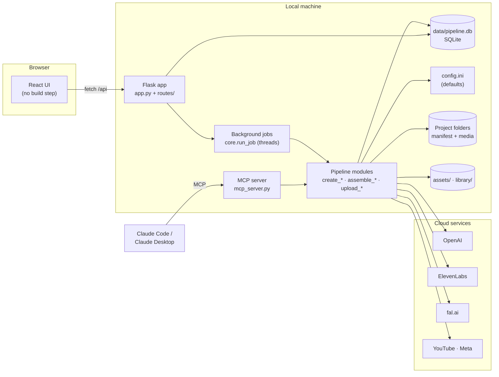
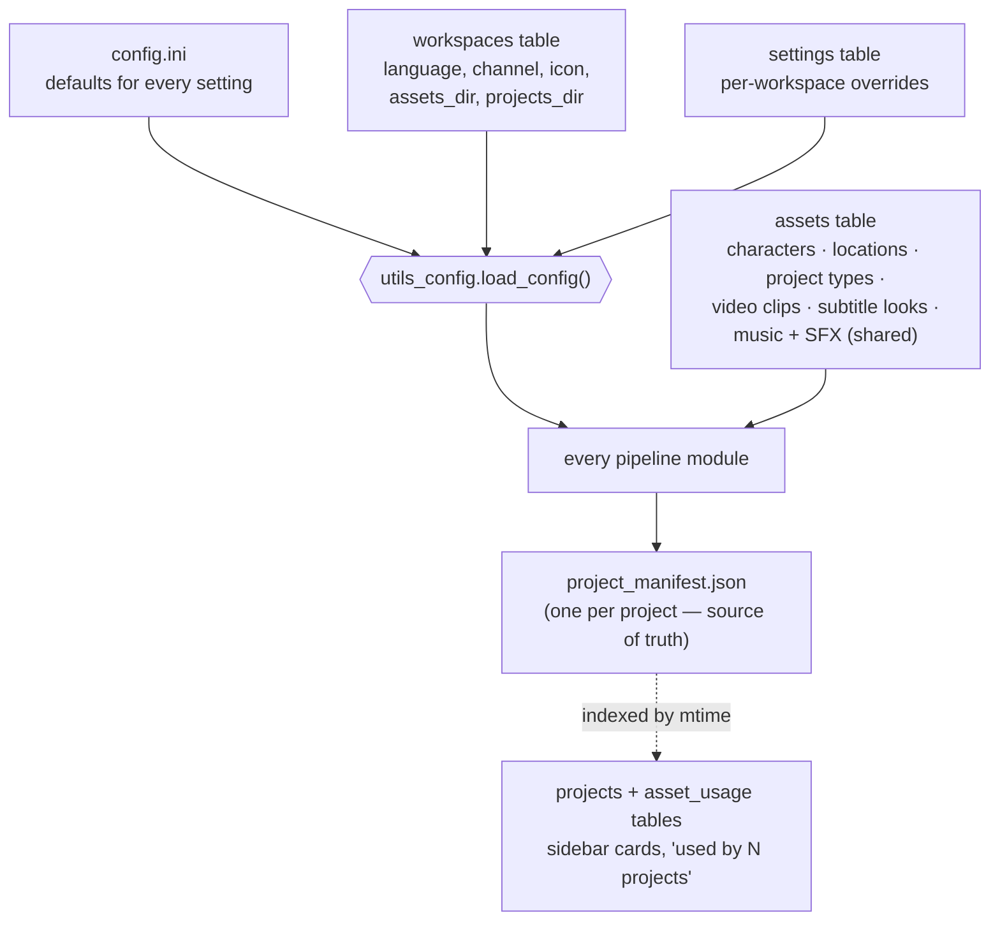
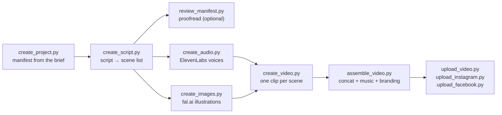

# How it is built

An overview of the architecture for anyone reading or extending the code: the moving parts, where data
lives, how a video flows through the pipeline, and the design decisions behind it.

← Back to the [README](../README.md) · Details: [Full reference](REFERENCE.md)

---

## The big picture



Everything runs locally. The browser talks to a Flask server; long steps run in background threads and
the UI polls their progress. The same pipeline modules are called from the web UI, the command line and
the MCP server, so all three behave identically.

---

## Where data lives

The storage is **hybrid**: one SQLite database for everything global, plain files for each project, and
media on disk.



| Data | Stored in | Why |
|---|---|---|
| Workspaces, setting overrides, asset catalog, project index | `data/pipeline.db` (SQLite, WAL mode) | Atomic writes shared safely by the Flask app and the MCP server; queries like "which projects use this track" |
| A project's scenes, script, prompts, render choices | `projects/<name>/project_manifest.json` | Read and written by ~20 pipeline modules; easy to inspect, diff and copy; the DB only indexes it |
| Images, audio, video | Files on disk | Paths in the DB are relative to the workspace's assets folder or the shared library |
| Defaults | `config.ini` (UTF-8, commented) | One place for defaults; its comments become the help text in Settings |
| Shipped video-type prompts | `defaults/project_types.json` (versioned) | Seed for fresh installs and "Reset to shipped" |

`db.py` is the only module that touches SQLite. Its tables:

| Table | Contents |
|---|---|
| `meta` | schema version, active workspace |
| `workspaces` | one row per language / channel |
| `settings` | `(workspace, section, key) → value` overrides of `config.ini` |
| `assets` | `(workspace, kind, key) → JSON document`; workspace `''` = shared library (music, SFX) |
| `projects` | cached sidebar summary per project + manifest mtime |
| `asset_usage` | which project uses which character / location / type / track / branding clip |

### Workspaces

`load_config()` reads `config.ini`, layers the active workspace's overrides on top, and swaps in that
workspace's folders and language. The active workspace is stored in the DB, so the web UI, CLI scripts
and MCP server always agree. The first (German) workspace uses `assets/` and `projects/` in place; new
ones get `workspaces/<slug>/assets` and `workspaces/<slug>/projects`.

### Folder layout

```
assets/                     workspace assets (others: workspaces/<slug>/assets)
  branding/                 icon, mascot, intro/outro clips
  characters/<name>/        34left.png (scene reference), art.png, thumbnail.png, ref_drawing.*,
                            candidates/  ← series-style art results waiting to be accepted
  locations/<key>/          background.png
  studios/podcast/          cached podcast studio images
  icons/  samples/          overlay icons, subtitle-preview backgrounds
  cache/                    regenerable caches
library/                    shared by every workspace
  music/  music/originals/  background music (+ untouched uploads for lossless re-gain)
  sfx/
projects/<name>/            project_manifest.json, script.txt, audio/, images/, videos/, final_*.mp4
data/                       pipeline.db, backups/, exports/   (git-ignored)
defaults/project_types.json shipped video-type prompts
```

---

## The pipeline

A project is a list of **scenes** in its manifest. Each step reads the manifest, does its work, and
writes results (file paths, durations, status) back into the same scenes.



| Module | Role |
|---|---|
| `create_project.py` | Creates the folder and manifest (type, level, brief, visual guidelines) |
| `create_script.py` | Fills the project type's prompt template, gets the script (GPT, or a script supplied by Claude), validates it, and builds the scenes: narration, dialog, pauses, repetitions, quiz rounds, podcast studio/example lines |
| `review_manifest.py` | GPT proofreading against fixed rules + deterministic checks; fixes are applied per finding |
| `create_audio.py` | ElevenLabs TTS per scene; SFX durations |
| `create_images.py` | Per-scene images with the fal edit model; every character's scene reference is sent as a separate image so several characters stay on-model |
| `create_video.py` | MoviePy clip per scene: image, audio, subtitles (`subtitle_render.py`), annotations (`html_annotation_renderer.py` via Playwright), countdowns, quiz chips, repeat scenes |
| `assemble_video.py` / `assemble_reading.py` / `podcast.py` | FFmpeg concat, speed, branding, background music per platform (`platform_audio.py`) |
| `upload_*.py` | YouTube Data API, Instagram/Facebook Graph API |
| Special types | `create_reading_source.py` (reading together), `create_song_source.py` (song), `create_promotional.py`, `podcast.py` |

**Project types are data.** A type is a JSON document: `description_for_prompt` (a template with
`{PLACEHOLDERS}`), `output_json_schema`, `scene_builder_rules` (what scenes to build) and options such as
`format`, `supports_multi_character`, `override_wardrobe`, `music_below_voice_db`. `*_long` types inherit
their prompt from a `base_type`. Adding a format usually needs no code — only a new type in
**Settings → Project types**.

### Supporting modules

| Module | Role |
|---|---|
| `utils_config.py` | Config loader (config.ini + workspace), catalog loaders, `apply_video_format()` for per-orientation overrides |
| `db.py` | All SQLite access |
| `languages.py` | The 20 supported languages (English name for prompts, native name, flag, speech-to-text code) |
| `manage_*.py` | Catalog CRUD for characters, locations, project types, music, SFX, clips (also usable as CLIs) |
| `character_art.py` | Series-style character art: drawing + style sample of existing characters + prompt → candidates |
| `audio_tools.py` | FFmpeg loudness measurement, middle-slice previews, lossless re-gain from the original |
| `music_level.py` | Suggested per-project music gain from measured voice and track levels |
| `migrate_to_db.py` | One-time migration from the old JSON registries; JSON export; fresh-install bootstrap |

---

## The web app

### Backend

`app.py` registers one Flask blueprint per area:

| Blueprint | Covers |
|---|---|
| `routes/projects.py` | Project list (cached index), manifest, scene edits, project files |
| `routes/pipeline.py` | Running each step as a job, job status, uploads, music-level suggestion |
| `routes/images.py`, `routes/prompts.py`, `routes/preview.py` | Sample images, prompt preview, subtitle previews |
| `routes/assets.py` | Asset catalog, file serving (`/asset-files`, `/library-files` with Range support), music volume tool, series-style character art |
| `routes/settings.py` | All settings (parsed from `config.ini` with its comments) + overrides; project-type editor |
| `routes/workspaces.py` | Create / clone / switch / remove workspaces, icon and mascot |
| `routes/styling.py` | Subtitle & overlay styling with live preview and saved looks |
| `routes/connections.py` | YouTube / Instagram / Facebook connection status and setup |

Long steps go through `core.run_job()`: it starts a thread, records status and progress
(`report_progress()` from inside a module), and the UI polls `/projects/<name>/status/<step>`. Routes read
the configuration per request, so switching workspace takes effect immediately; switching is refused
while a job runs. The server runs without Flask's reloader so a render is never interrupted.

### Frontend

React 18 without a build step. `templates/index.html` loads React and Babel from a CDN and a small
loader compiles each JSX file **once**, caching the result in `localStorage` under a hash of the source —
later loads skip compilation (about 1.4 s to first render). Files run in order in the global scope, so
components are plain global functions shared across files.

| File | Contents |
|---|---|
| `AppContext.js` | Global state: projects, current project + manifest, workspaces, toasts, job polling, workspace switching |
| `api.js` | `apiGet/Post/Put/Patch/Delete`, shared image-model list |
| `App.js` | Header (logo, workspace switcher, Projects / Assets / Settings), layout |
| `Sidebar.js`, `Modals.js` | Project list with search; New Project dialog (types loaded from the workspace) |
| `ProjectView.js`, `PipelineTab.js`, `ItemsTab.js`, `ManifestTab.js` | A project: steps, scene cards, manifest overview |
| `AssetsTab.js` | Characters, locations, music (player + volume tool), SFX, branding, series-style art panel |
| `SettingsView.js`, `SubtitlesTab.js`, `ConnectionsTab.js` | Settings sections |

### MCP server

`mcp_server.py` (MCP Python SDK) exposes discovery tools (`get_workspace`, `list_project_types`,
`list_characters`, `list_locations`), `create_project`, `get_script_instructions` / `submit_script`
(Claude writes the script; no OpenAI call), opt-in `generate_script`, `get_project_status` and the podcast
Shorts tools. It calls the same modules as the web app and follows the active workspace.

---

## Design decisions

- **Hybrid storage.** Project manifests stay JSON because the whole pipeline is built around them and
  they are easy to inspect; only global, shared, frequently queried data moved to SQLite.
- **Defaults + overrides.** `config.ini` keeps one commented default per setting; workspaces store only
  what they change. "Reset" deletes an override.
- **Prompts as data with placeholders.** Language, channel and hashtags are injected (`{LANGUAGE}`,
  `{CHANNEL}`, `{HASHTAGS}`), so one prompt serves every workspace while staying editable.
- **Nothing is overwritten silently.** Character art lands as candidates; music gain is re-applied from
  the kept original; migrations back up first and never touch project folders.
- **Separate references, not collages, for scenes.** Each character's reference is its own image in the
  fal edit call — the model keeps several characters on-model. The style sample for new characters is
  the exception: there one combined image *is* the point.
- **Measured, not guessed.** Music gain suggestions come from measured levels (voice median, track
  mean, background volume) and a target gap taken from mixes done by ear.

---

## Extending

| You want to… | Do this |
|---|---|
| Add a video format | Duplicate a similar type in **Settings → Project types** and edit its prompt / rules. Code is only needed for a new scene pattern (`create_script.build_scene_list`) or render effect (`create_video.py`). |
| Add a setting | Add the key with a comment to `config.ini`, read it in `utils_config.load_config()`. It appears in **Settings → All settings** automatically; add it to a curated group in `SettingsView.js` if it deserves one. |
| Add a language | Add an entry to `languages.py` (name, native name, flag code, speech-to-text code). |
| Add an image model | **Settings → All settings → `[fal_models]`**: `name = fal endpoint id`. |
| Add an API route | Add it to the matching blueprint in `routes/`; read folders via `core.assets_dir()` / `projects_dir()` (never at import time). |
| Add a frontend component | Write a global function in a component file; if it is a new file, add it to the loader list in `templates/index.html`. Give module-level names a unique prefix — all files share one scope. |

## Testing and conventions

- Tests: `python -m pytest -q test_supplied_script.py test_subtitle_render.py test_reading_source.py test_concat_batches.py` (script building, subtitles, reading source, concat batching; the annotation-renderer tests need Playwright / an Ideogram key).
- `moviepy==1.0.3` and `numpy<2` are pinned — the code uses the MoviePy 1.x API.
- `config.ini` is read as UTF-8; inline comments use `;` preceded by whitespace (`#` would break hex
  colours).
- Paid API calls only happen behind an explicit button or confirmation; previews and checks are free.
