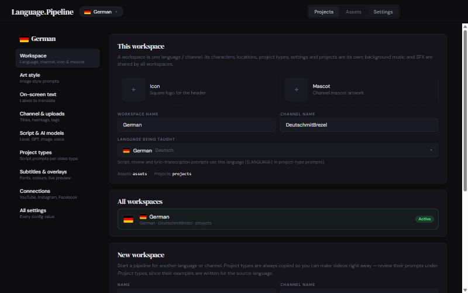
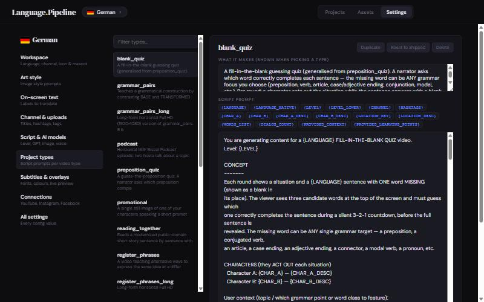
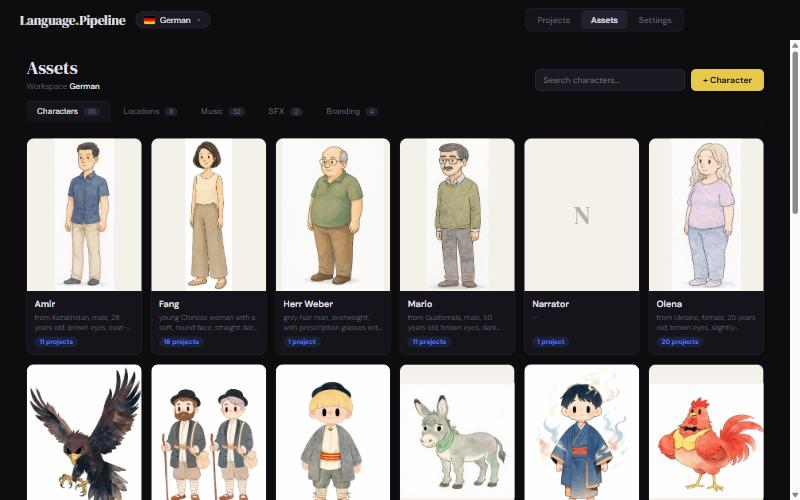
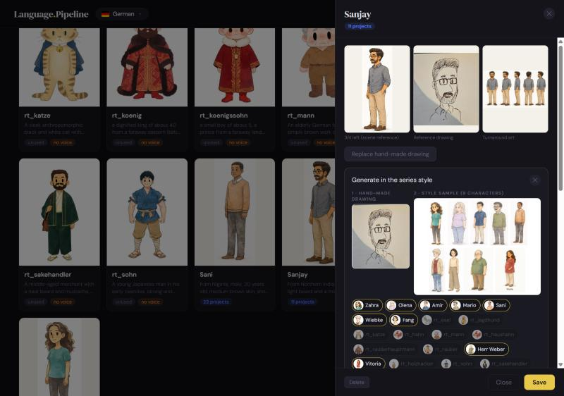
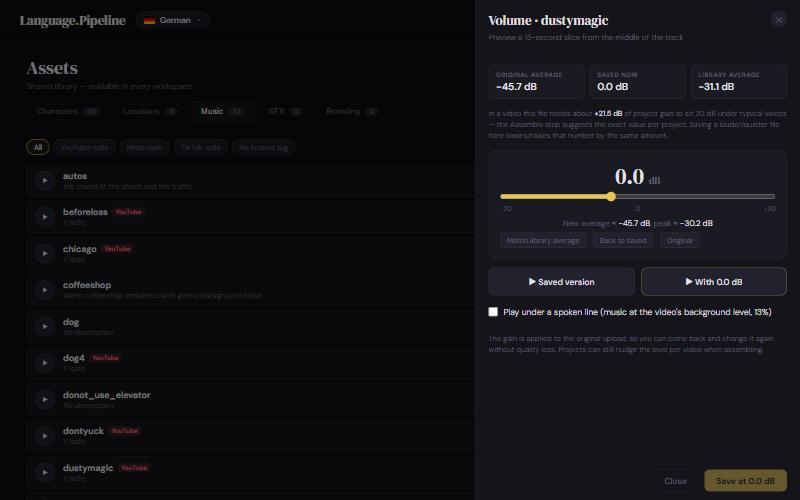

# Getting started

This guide takes you from a fresh clone to a workspace that is ready to make videos: install, add your
API keys, then configure everything in **Settings** — language, channel, art style, on-screen labels,
characters and music. No file editing is needed after the API keys.

← Back to the [README](../README.md) · Next: [Using it](USAGE.md)

---

## 1. Install

**Requirements:** Windows, Python 3.10–3.12, FFmpeg + FFprobe, ImageMagick, and Chromium for
Playwright. The installer takes care of all of them.

```bat
git clone https://github.com/ocastillogtz/language-learning-slideshow-videos-AI.git
cd language-learning-slideshow-videos-AI
install_dependencies.bat
```

`install_dependencies.bat` finds (or creates) a compatible Python, installs `requirements.txt`, installs
Playwright's Chromium, installs FFmpeg and ImageMagick through `winget`, and finishes with a dependency
check. You can re-run the check any time:

```bat
python check_dependencies.py
```

> Python 3.13+ is not supported: MoviePy 1.0.3 (pinned) needs NumPy 1.x, which has no prebuilt wheels
> for 3.13.

## 2. Add your API keys

```bat
copy .env.example .env
```

| Key | Service | Used for |
|---|---|---|
| `OPENAI_API_KEY` | [OpenAI](https://platform.openai.com/api-keys) | Writing and reviewing scripts (not needed if Claude writes them via MCP) |
| `ELEVENLABS_API_KEY` | [ElevenLabs](https://elevenlabs.io) | Voices, song lyric transcription |
| `FAL_KEY` | [fal.ai](https://fal.ai) | All images: scenes, character and location art |
| `FB_APP_ID`, `FB_APP_SECRET` | [Meta for Developers](https://developers.facebook.com) | Optional — Instagram / Facebook uploads |
| `GOOGLE_CLIENT_ID`, `GOOGLE_CLIENT_SECRET` | Google Cloud | Optional — YouTube uploads (or use a `client_secret.json`) |

`.env` and all credential files are git-ignored. Account connections (YouTube, Instagram, Facebook) are
done later in **Settings → Connections**.

## 3. Start the app

```bat
launch.bat
```

It picks the Python that has the dependencies, starts the server and opens
<http://127.0.0.1:5000>. (`python app.py` works too.) On the very first start the app creates a
default workspace with the shipped video types.

> The server does not auto-reload. Restart it after changing Python code.

---

## 4. Set up your workspace in Settings

Open **Settings** in the header. Everything you change here is saved **for the active workspace**;
`config.ini` holds the defaults, and every customised value shows a **"Customised · reset"** badge to go
back to the default. Changes are collected in a save bar at the bottom — nothing is saved until you
press **Save changes**.

<p align="center">
  
</p>

### Workspace

- **Language being taught** — pick one of the 20 most spoken languages. The script, review and
  lyric-transcription prompts use it automatically.
- **Workspace name** and **channel name** — the channel name is available to prompts as `{CHANNEL}`.
- **Icon** and **mascot** — click to upload. The icon appears in the header next to the logo.
- **All workspaces / New workspace** — see [Adding another language](#6-adding-another-language-or-channel).

### Art style

The four prompts that define how every image looks:

| Setting | What it controls |
|---|---|
| Scene art style | Prepended to every scene illustration (medium, palette, outlines, eye style…) |
| Framing / composition | Where characters sit in the frame, margins, vignette |
| Character art style | Appended when generating character art |
| Location art style | Appended when generating location backgrounds |

Write them in English; be explicit about anything brand-critical (e.g. the eye style).

### On-screen text

Words burned into the videos — **translate these** for a new language: the shadowing "repeat now" cue,
the reading-video part label and "to be continued" card, the podcast name and call to action on
Shorts, the full-episode link label, and the lyrics transcription language.

### Channel & uploads

Hashtags, the suffix added to Short titles, the fallback title and description footer, and the YouTube
tags added to every upload.

### Script & AI models

Default CEFR level, the OpenAI models for writing and reviewing, the max number of characters per
image, the fal.ai image models, and the ElevenLabs voice model. Extra fal models can be added under
**All settings → `[fal_models]`** (`name = fal endpoint id`); they then appear in every model dropdown.

### Project types

<p align="center">
  
</p>

Each video type is a prompt plus a few rules. Pick a type to edit what it makes and its script prompt.
Click a placeholder chip to insert it at the cursor:

| Placeholder | Filled with |
|---|---|
| `{LANGUAGE}` / `{LANGUAGE_NATIVE}` | The workspace language ("German" / "Deutsch") |
| `{LEVEL}` / `{LEVEL_LOWER}` | The project's level |
| `{CHAR_A}`, `{CHAR_B}`, `{CHAR_A_DESC}`, `{CHAR_B_DESC}` | The cast and their descriptions |
| `{PROVIDED_CONTEXT}`, `{PROVIDED_LEARNING_POINTS}`, `{WORDS_LIST}`, `{DIALOG_COUNT}` | The project brief |
| `{CHANNEL}`, `{HASHTAGS}` | Channel settings |

Write literal braces (for JSON examples) doubled: `{{ }}`. The **Advanced** section holds the output
schema and scene rules as JSON. **Duplicate** makes a variant, **Reset to shipped** restores the
original prompt.

### Subtitles & overlays

Fonts, colours, outlines and positions for every on-screen text, with a live preview on a sample frame.
Font size and bottom margin are set per orientation (vertical / horizontal). Save named looks as
profiles and switch between them.

### Connections

Connect YouTube, Instagram and Facebook. Step-by-step platform setup (Google Cloud OAuth, Meta app) is
in the [full reference](REFERENCE.md#connecting-your-accounts-youtube--instagram--facebook).

### All settings

Every value of `config.ini`, grouped by section, with its explanation and a search box — render sizes,
pauses, countdowns, quiz chips, reading-video timing, podcast Shorts, music levels and more.

---

## 5. Add your assets

Open **Assets**. Characters, locations and branding belong to the workspace; **music and SFX are
shared** by all workspaces. Every asset shows how many projects use it.

<p align="center">
  
</p>

### Characters

1. **+ Character** — name, *fixed description* (identity: age, origin, face, hair — never changes),
   *default outfit*, ElevenLabs voice id and height.
2. Open the character and **upload a hand-made drawing**.
3. **Generate art in the series style…** — the fal edit model receives your drawing, one image of the
   existing characters side by side as a style sample (choose who is in it; the preview is free), and
   an editable prompt. Pick the model and size, press **Generate (paid)**.
4. Each result is kept as a candidate. Accept the one you like as **scene reference** (the image used
   to keep the character on-model in every scene), thumbnail or turnaround.

<p align="center">
  
</p>

### Background music

**+ Track** uploads an MP3, MP4 (the audio is extracted), WAV or M4A, with the platforms it is safe
for (YouTube / Meta / TikTok). Then open **Volume**:

<p align="center">
  
</p>

- See the track's average level next to the library average.
- Move the slider and listen to a 15-second slice from the middle — **Saved version** vs. **With +x dB**,
  optionally **under a spoken line** at the level a finished video uses.
- **Save** re-encodes from the kept original, so you can change it again later without quality loss.

You rarely need to touch per-video gain afterwards: the Assemble step suggests it (see
[Using it](USAGE.md#6-render-and-assemble)).

### Locations, SFX, branding

- **Locations** are optional — by default each project describes its own setting through its visual
  guidelines.
- **SFX** are short sounds (bell, spoken cues) used by the shadowing types.
- **Branding** holds intro/outro clips you can attach when assembling.

---

## 6. Adding another language or channel

**Settings → Workspace → New workspace**: give it a name, a language and a channel name, choose which
workspace to copy from, and tick what to bring along:

- **Settings** (art style, labels, subtitle styling…) — usually yes.
- **Characters** / **Locations** — copied with their art.

Project types are always copied so the new workspace can make videos right away. Their prompts name the
language through `{LANGUAGE}`, but their **examples are written for the source language** — review them
in **Settings → Project types** and translate the on-screen text before your first video.

Switch workspaces from the pill next to the logo. The web UI, the command-line scripts and the Claude
(MCP) tools all follow the active workspace. Switching is blocked while a pipeline job runs.

---

## 7. Backups and upgrading

Your data lives in two places — back up both:

- `data/pipeline.db` — workspaces, settings, the asset catalog and the project index.
- The media folders: `assets/`, `library/`, `projects/` (and `workspaces/` for extra workspaces).

`python migrate_to_db.py --export` writes every catalog and setting to JSON under `data/exports/`.

**Upgrading from the JSON version** (an install with `assets/**/*.json` files): run
`python migrate_to_db.py --dry-run` to preview, then `python migrate_to_db.py`. It backs up to
`data/backups/`, imports everything and reorganises the files; project folders are not touched.
