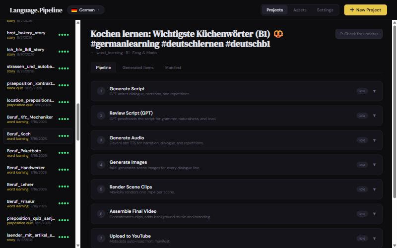
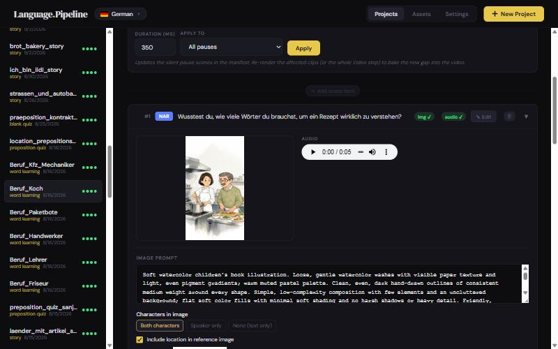

# Using it

How to make a video, from idea to upload. It assumes your workspace is set up — if not, start with
[Getting started](GETTING_STARTED.md).

← Back to the [README](../README.md) · Architecture: [How it is built](ARCHITECTURE.md)

---

## Two ways to work

| | **Web UI** | **Claude (MCP)** |
|---|---|---|
| How | Click through the steps in the browser | Chat with Claude in Claude Code / Claude Desktop |
| Script written by | GPT (OpenAI credits) | Claude itself — no OpenAI call |
| Covers | Every step, end to end | Creating the project and writing the script |

A common workflow combines them: refine the idea and write the script with Claude, then open the project
in the web UI for audio, images, assembly and upload. Both share the same project files.

**What costs money:** script and review (OpenAI), audio (ElevenLabs), images and character art
(fal.ai). Rendering, assembly, previews and every free check run locally. Paid steps run only when you
press their button; character art and similar actions ask for confirmation first.

---

## The web UI path

The **Projects** view lists the workspace's projects (newest first) with a search box. The four dots
next to each project show its progress: script · audio · images · video.

<p align="center">
  
</p>

### 1. Create the project

Press **New Project** and fill in:

| Field | Notes |
|---|---|
| Project name | Becomes the folder name (spaces become `_`) |
| Project type | Grouped by format: vertical Shorts, horizontal YouTube, special flows. The description of the selected type is shown below it. |
| Language level | A1–C2 |
| Scene description | What happens, where, the topic — the single most important input |
| Learning points | Grammar or vocabulary to cover (for *Word learning*: the comma-separated word list) |
| Visual guidelines | Setting, clothing, props and mood applied to **every** image, e.g. *"a cozy bakery; both wear white aprons and hair nets; warm morning light"* |

With visual guidelines you don't need a pre-made location: the environment and outfits come from the
text. The illustrator only honours a costume when the text names it, so say who wears what.

### 2. Generate the script

Open the project → **Pipeline** → **Generate Script**. Choose the characters (multi-character types
accept more than two), optionally a location and the number of lines, and press run. You can expand the
**prompt** first to read or edit exactly what will be sent.

The result — title, tags, description, narration, dialog with per-line image descriptions and, for
shadowing, the three repetition sentences — becomes the project's scene list.

### 3. Review the script (optional)

**Review Script (GPT)** proofreads every line against fixed rules: grammar, spelling, level fit,
coherence, register (formal/informal), vocabulary highlights, and whether each image description
matches its line and only shows characters who are in the scene. Findings appear with a proposed fix
you can apply one by one or all at once. A free deterministic pass also catches missing highlights
and thin image descriptions.

### 4. Generate audio and images

- **Generate Audio** voices every line with the character's ElevenLabs voice and measures durations.
- **Generate Images** illustrates every line. Each image is generated from the characters' scene
  reference art, so recurring characters stay recognisable. Pick the image model from the dropdown.

Both show a progress bar and can be re-run; existing files are kept unless you ask to overwrite.

### 5. Check and fix scenes — Generated Items

<p align="center">
  
</p>

Every scene is a card with its text, image, audio and status. In a card you can:

- edit the text, speaker or image prompt and **regenerate just that image or audio**;
- choose who appears in the image (both characters, speaker only, none) and whether the location
  reference is used;
- insert or delete scenes, and change pauses (one by one or in bulk);
- add **shadowing "repeat" scenes** after each line (same image, subtitle still readable, a centred
  "repeat now" cue) with a time factor for extra practice time.

### 6. Render and assemble

- **Render Scene Clips** turns each scene into a clip: image, voice, subtitles with highlighted words,
  optional grammar annotations and footnotes.
- **Assemble Final Video** joins the clips and adds:
  - **background music per platform** — a YouTube track, and optionally a Meta (Instagram/Facebook)
    track, each written to its own file (`final_<project>_YT.mp4`, `_Meta.mp4`);
  - the **volume** of each track. A green **"Suggested +x dB"** chip under each Volume field
    computes the gain that puts the music the usual distance under *this project's* voices (20 dB, or
    11 dB for quizzes — set in Settings → `[assembly] music_below_voice_db`). Click it to use it;
  - playback speed, and an intro/outro branding clip.

  Your choices are remembered per project, so re-assembling doesn't mean picking them again.

### 7. Upload

**Upload to YouTube / Instagram / Facebook** pre-fill title, description, tags and hashtags from the
script and the workspace's channel settings. Each platform uses its own music variant automatically.
Connect the accounts first in **Settings → Connections**.

---

## Special video types

| Type | How it differs |
|---|---|
| **Reading together** | Paste a public-domain story in the new-project dialog. **Build Reading Source** modernises it to the chosen level and splits it into sentences; **Cast Characters** finds the characters and creates single-image references for them; the video shows each sentence with grammar annotations and a pause to read first. **Assemble Parts + Long** produces several vertical parts plus one horizontal long video. |
| **Song** | Bring a finished audio file. **Build Song Source** transcribes the lyrics with timestamps and shows a new illustration every few seconds (performer costume from the visual guidelines); the song itself is the soundtrack. |
| **Song quiz** | Viewers guess a song from its translated lyrics; the cast is re-costumed per round. |
| **Preposition quiz / Fill-in-the-blank quiz** | Each round shows the situation with a blank, three options, a silent 3-2-1 countdown, then the answer. |
| **Podcast** | Two hosts in a fixed studio (one cached studio image) with illustrated cut-aways for examples. A horizontal episode, plus **Build Shorts** that re-cuts the best moments as vertical Shorts linking to the episode. |
| **Promotional** | One character, one image, one spoken line — for Instagram stories. Set up in **Build Promotional Scene**. |

All other types follow the standard seven steps above.

---

## The Claude (MCP) path

`mcp_server.py` lets Claude create projects and write scripts directly. In Claude Code the server is
registered by `.mcp.json` — open Claude Code in the project folder and approve it (check with `/mcp`).
For Claude Desktop, see the [full reference](REFERENCE.md#claude-code-mcp-bridge).

Then just talk:

> "Create a shadowing project called cafe_smalltalk, level A2: two friends order coffee and make weekend
> plans; learning point: separable verbs; visual guidelines: cozy café, casual clothes. Write the script
> with Zahra and Amir."

Claude calls `get_workspace` (which language to write in), `list_project_types` / `list_characters`,
`create_project`, `get_script_instructions` (the exact prompt and JSON format GPT would get), writes the
script itself and sends it with `submit_script`. No OpenAI credits are used unless you explicitly ask
for GPT (`generate_script`). Then open the project in the web UI and continue from step 3.

> Pipeline code edits are picked up automatically on the next tool call. Only changes to `mcp_server.py` itself need a reconnect of the MCP server.

---

## Command line

Every step also runs from a terminal in the active workspace, e.g.:

```bat
python create_audio.py my_project
python create_images.py my_project
python create_video.py my_project
python assemble_video.py my_project --bg-audio dustymagic --bg-audio-gain-db 20
```

See the [full reference](REFERENCE.md#cli-usage) for all commands and options.

---

## Tips and troubleshooting

- **Cheap iterations:** fix text in Generated Items and regenerate single images/audio instead of
  re-running whole steps.
- **A character looks wrong in an image:** the scene's image description mentions someone who is not in
  that scene. Either include them (*both*) or rewrite the description — the review step flags this.
- **Music too loud or quiet everywhere:** adjust the track once in **Assets → Music → Volume**, or change
  `music_below_voice_db` instead of tweaking every project.
- **"Failed to fetch" after editing code:** the server doesn't auto-reload — restart it.
- **Something missing in a workspace:** characters, locations and project types are per workspace;
  music and SFX are shared.
